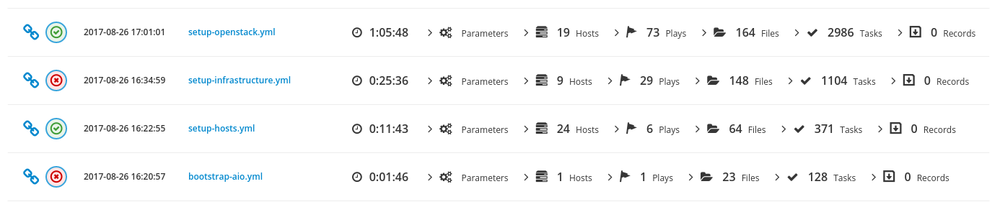

# What's ARA ?

ARA Records Ansible playbooks and makes them easier to understand and troubleshoot.



ARA saves playbook results to a local or remote database by using an Ansible
callback plugin and provides an API to integrate this data in tools and interfaces.

The [ara](https://github.com/ansible-community/ara) project provides ARA's
Ansible roles and plugins, the REST API server as well as simple built-in web
interfaces to browse the recorded data.

The [ara-web](https://github.com/ansible-community/ara-web) project provides a
stateless javascript client interface to the ARA API.

## How does it work ?

ARA Records Ansible playbooks through an Ansible
[callback plugin](https://docs.ansible.com/ansible/latest/plugins/callback.html).


0. ARA is installed and Ansible is configured to use the callback plugin
1. An ``ansible-playbook`` command is executed
2. Ansible triggers the callback plugin for every event (``v2_playbook_on_start``, ``v2_runner_on_failed``, etc.)
3. The relevant information is retrieved from the Ansible playbook execution context and is sent to the API server
4. The API server validates and serializes the data before storing it the configured database backend
5. The API server sends a response back to the API client with the results
6. The callback plugin returns, ending the callback hook
7. Ansible continues running the playbook until it fails or is completed (back to step 2)

Once the data has been saved in the database, it is made available for query by
the API and web interfaces.

## Quickstart

Here's how you can get started from scratch with sane defaults with python>=3.6:

```
# Install ARA and Ansible for the current user
python3 -m pip install --user ansible "ara[server]"

# Tell Ansible to use the ARA callback plugin
export ANSIBLE_CALLBACK_PLUGINS="$(python3 -m ara.setup.callback_plugins)"

# Run your playbook
ansible-playbook playbook.yml
```

If nothing went wrong, your playbook data should have been saved in a local
database at ``~/.ara/server/ansible.sqlite``.

You can take a look at the recorded data by running ``ara-manage runserver``
and pointing your browser at http://127.0.0.1:8000/.

That's it !

For more information, refer to the documentation on
[installation](https://ara.readthedocs.io/en/latest/installation.html) and
[configuration](https://ara.readthedocs.io/en/latest/ansible-configuration.html).

## Live demos

You can find live demos deployed by the built-in [ara_api](https://ara.readthedocs.io/en/latest/ansible-role-ara-api.html)
and [ara_web](https://ara.readthedocs.io/en/latest/ansible-role-ara-web.html)
Ansible roles at https://api.demo.recordsansible.org and https://web.demo.recordsansible.org.

## ARA is free and open source

ARA is free and open source under the GPLv3 license.

The code review and CI infrastructure is hosted by [OpenDev](https://opendev.org).

You can participate in [code reviews](https://review.opendev.org/#/q/project:%255Erecordsansible/.*)
and learn how you can contribute your first patch in the [contributors documentation](https://ara.readthedocs.io/en/latest/contributing.html).

## ARA is tested, stable and production ready

Each new commit to ARA is gated against a series of unit and integration tests
against different Linux distributions and versions of Ansible in order to
prevent regressions.

ARA is used to record more than a [million playbooks a month](http://superuser.openstack.org/articles/scaling-ara-ansible/) from the OpenStack community alone.

It works.

## ARA is offline and decentralized by default

Running Ansible from your laptop ? No problem.

You can browse your ARA reports locally from a sqlite database without ever leaving the comfort of localhost.

Need to aggregate data from multiple locations ?
You can run an API server and hook it up to a database engine like
[PostgreSQL or MySQL](https://ara.readthedocs.io/en/latest/api-configuration.html#ara-database-engine).
