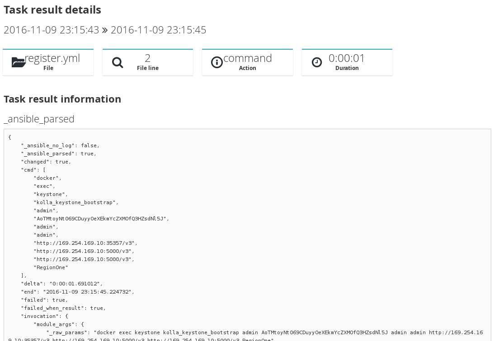

[Kolla](https://github.com/openstack/kolla) is an [OpenStack](http://www.openstack.org/) deployment tool that's growing
in popularity right now.

An OpenStack installation by Kolla was even showcased by [Chris Hoge](https://twitter.com/hogepodge) and
[Mark Collier](https://twitter.com/sparkycollier) in one of the main [keynotes](https://www.youtube.com/watch?v=GGxzlLwt6WA&t=1325)
at the recent [Barcelona OpenStack Summit](https://www.openstack.org/summit/barcelona-2016/).



## Installing OpenStack is complex

Installing and configuring OpenStack is no easy task -- Kolla tackles this challenge with the help of [Docker](https://www.docker.com/)
containers that are deployed with [Ansible](https://www.ansible.com/).

This translates into quite a few playbooks, lots of plays, many more tasks and especially lots of data to parse through
when trying to understand what is going on.

I was recently pleased to learn that the Kolla project implemented [ARA](https://github.com/ansible-community/ara) to help them
troubleshoot their CI jobs.

## Installing ARA is simple

How hard was it to integrate ARA with Kolla ? Eight lines of code.
8 lines of code, that's what's what it took and all you'll see in the [code review](https://review.openstack.org/#/c/368345/)
to implement it.

## I'm happy

I'm very happy about this because this is exactly what I have been targetting with ARA.
A tool that provides a lot of value while staying very simple, requires little configuration, is seemless and above all,
doesn't get in the way of your existing workflows.

## What it looks like

So, now that Kolla has integrated ARA, what does it look like ?

Let's look at a typical code review in Gerrit, we can see that one of the gate jobs failed:

Clicking on the job link will send us to the logs where Kolla generated the ARA report inside the playbook_reports folder:

Entering that folder gets us directly to a statically generated version of the ARA web application.
We can see that two playbooks have been run and one of them has a failed task:

Clicking on that particular playbook brings up the playbook summary page:

You can then drill down directly to the failed tasks by clicking on the appropriate column:

Drilling down further into the particular task that failed, we see that ARA records everything from it and makes it available:

If we're interested in seeing what the actual Ansible task looks like, clicking on the file line card gets us to a saved
copy of the whole file, highlighting the line number where the task took place:

## This is great, let's make it better

It's great that people are using ARA and finding it useful.
I like the current state of ARA and the direction it's going but I'm also very excited about the awesome opportunities
some new features landing in the next release will open up.

If you'd like to come chat with me about ARA, ask questions or would love to get involved, come join us on IRC.
We hang out on the #ara channel on freenode !
