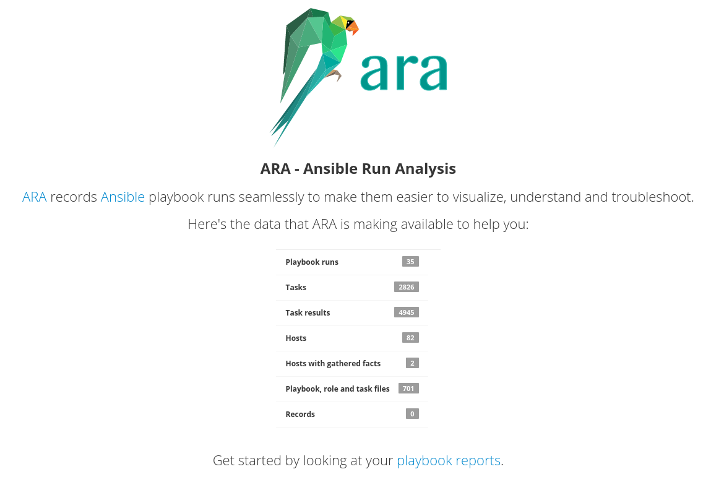
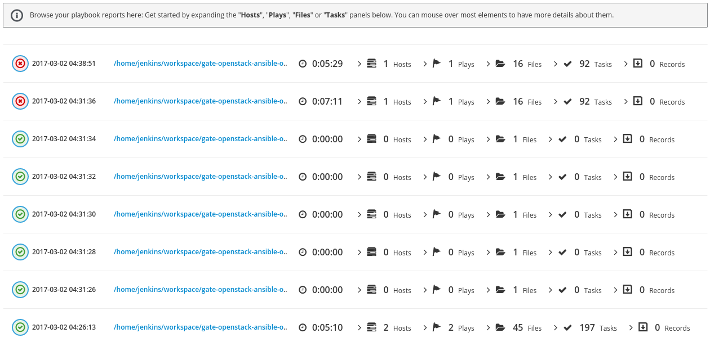
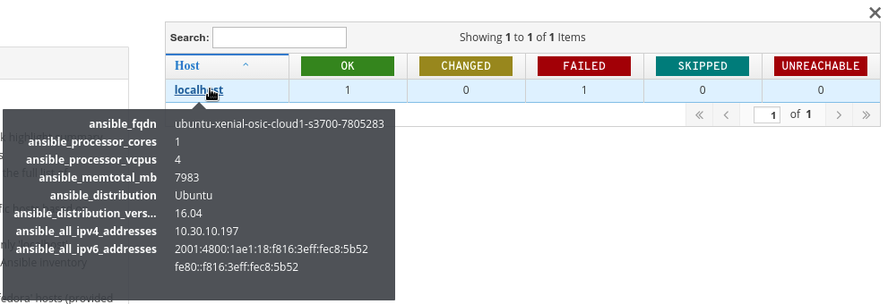
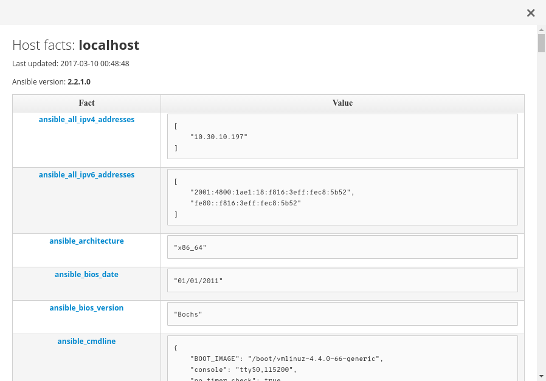
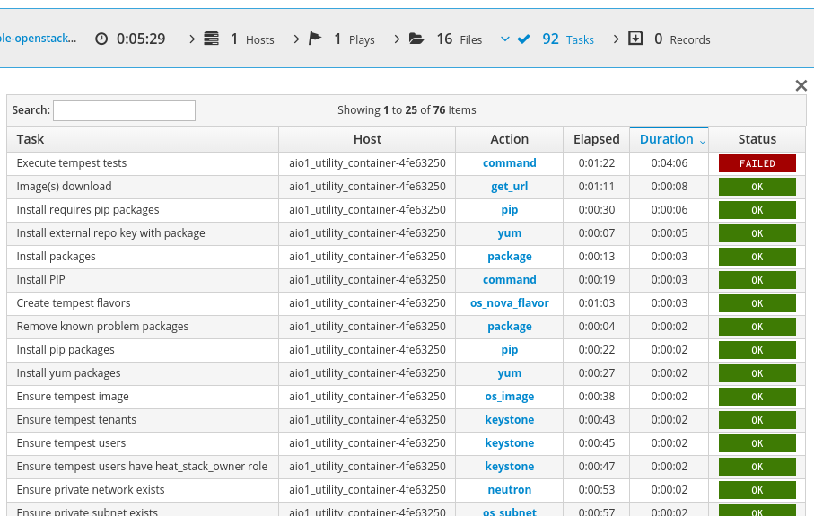
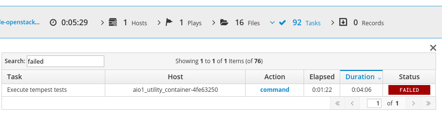
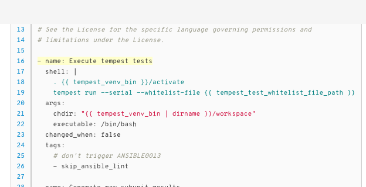
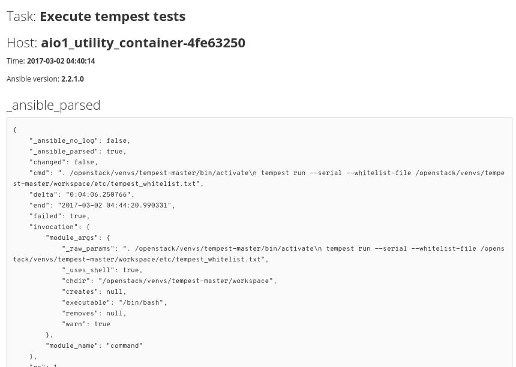

Not even a month ago, I announced the release of [ARA 0.11](https://dmsimard.com/2017/02/13/announcing-the-ara-0.11-release/) with a bunch of new features and improvements.

Today, I'm back with some more great news and an awesome new release, ARA 0.12(.3) !

That's right, 0.12.3!

Due to the nature of this new release, I wanted to be sure to get feedback from the users before getting the word out.

We got a lot of great input! This allowed us to fix some bugs and significantly improve the performance.

0.12 features a completely re-written and re-designed web application user interface. Let's look at some of the highlights !

## A new web application interface

I know what you're most interested in is... WHAT DOES IT LOOK LIKE !?

### What it looks like

Here's some highlights of the new user interface -- it doesn't end here so please
read on !

The home page now features the data recorded by ARA:

The core of the user interface now revolves around one and single page where you'll be able to find all the information about your playbooks:

Quickly have a glance at your playbook host summary:

Or dig into the host details to look at all the facts Ansible gathered for you:

Figure out which tasks took the longest just by sorting the table accordingly:

Or search to figure out which tasks failed:

Click on the action to get context on where this task ran:

Or click on the status to take a look at all the details Ansible has to offer:

## The logic behind the UI changes

There were three main objectives with this refactor of the web interface.

### Improve UX

A lot of effort was spent on the user experience.
You need to be able to find what you want: intuitively, quickly and easily.

Data and result tables are now sortable and searchable by default and browsing
tips were added to the interface to help you make the most of what it has to
offer.

### Scalability and performance

The interface must be fast, responsive, clutter-free, make sense and behave
 consistently across your use case scenarios, whether you are looking at
reports which contains five tasks or ten thousand.

Pagination settings have been introduced in order to customize your browsing
experience according to your needs.

### Static report generation time and weight

Another objective of this user interface work was to optimize the static report
generation performance and weight.

Static generation is one of the great features of ARA which is very heavily used
in the context of continuous integration where the report is generated and
attached to the artifacts of the job.

Here's a real-life example of the same database being generated on ARA 0.11 and
ARA 0.12:

ARA integration tests (5 playbooks, 59 tasks, 69 results):

* Before: 5.4 seconds, 1.6MB (gzipped), 217 files
* After: 2 seconds, 1.2MB (gzipped), 119 files

OpenStack-Ansible (1 playbook, 1547 tasks, 1667 results):

* Before: 6m21 seconds, 31MB (gzipped), 3710 files
* After: 20 seconds, 8.9MB (gzipped), 1916 files

For larger scale playbooks, we're looking at a generation performance that is
over 19 times faster. I'm really happy about the results.

## But wait, there's more

If you thought the UI work was enough to warrant it's own release, you're right !

Some other changes also sneaked their way into this release as well.

### First party WSGI support

A lot of ARA users were interested in scaling their centralized deployment.
This meant helping users deploy the ARA web interface through WSGI with a web server.

To help people get going, we now ship a WSGI script bundled with ARA and documented
how you can set it up with Apache and mod_wsgi.
The documentation is available [here](http://ara.readthedocs.io/en/latest/webserver.html).

### Other things

* Fixed syntax highlighting when viewing files
* Preparations for supporting the upcoming Ansible 2.3 release
* Started working on full python 3 support
* Various performance improvements

## Well, that's it for now

That was certainly a lot of stuff in one release !

I hope you're enjoying ARA - if you're not using it yet, it's easy !

Have a look at the documentation to learn how to [install ARA](http://ara.readthedocs.io/en/latest/installation.html)
and how to [configure Ansible](http://ara.readthedocs.io/en/latest/configuration.html) to use it.

If you have any questions, feel free to drop by on IRC in #ara on the freenode server or hit me up on twitter: [@dmsimard](https://twitter.com/dmsimard).
