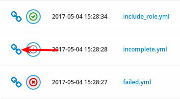
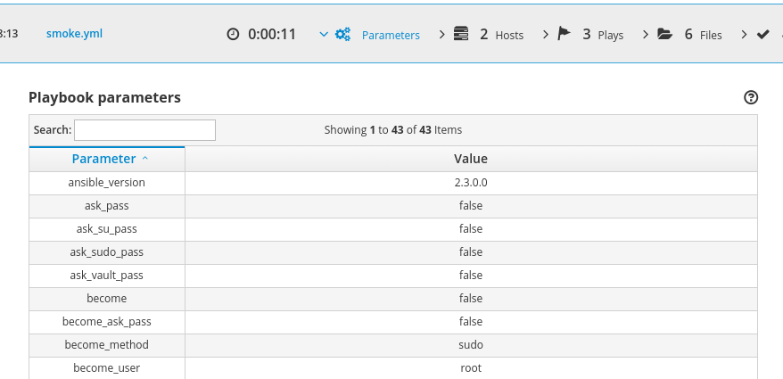
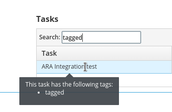
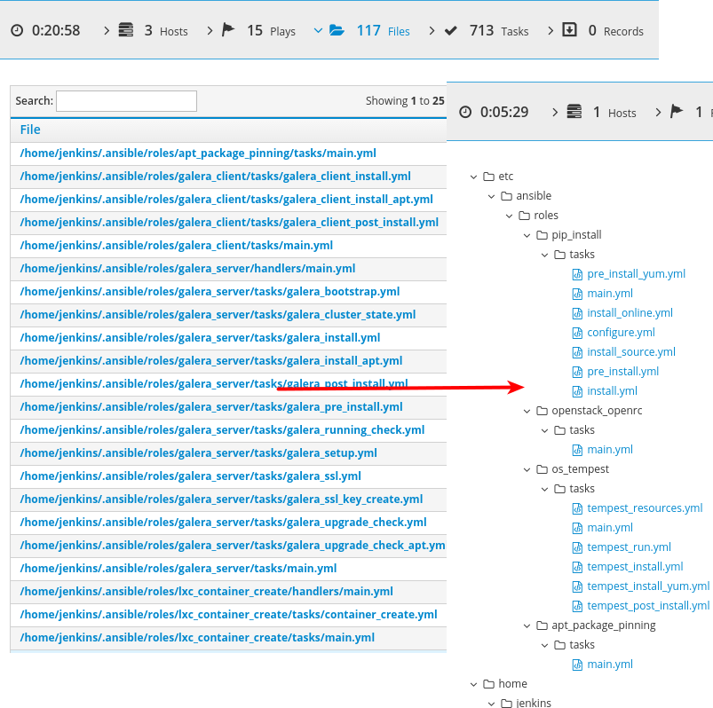

I'm excited to announce the release of ARA: Ansible Run Analysis 0.13.0!

ARA 0.13.0 is available on [PyPi](https://pypi.python.org/pypi/ara) or from source on [GitHub](https://github.com/openstack/ara).
I'm also happy to announce that ARA 0.13.0 will be the first version of ARA packaged for Fedora and CentOS EPEL.

Stay tuned in the near future to hear when the packages will be available.

## Wait, what's ARA ?

ARA is an Ansible callback plugin that records your playbook runs, wherever it is.

Whether you're running Ansible from your personal laptop or from a server,
you basically just need to [install ARA](http://ara.readthedocs.io/en/latest/installation.html),
configure [Ansible](https://ara.readthedocs.io/en/latest/configuration.html#ansible) to use ARA and you're good to go.

ARA organizes the data in a way to help you visualize, understand and troubleshoot
what happened throughout your playbook.

So, what does it look like ?
Here's a video demo of the interface where I explain the different features it
offers:



ARA also provides a [command line interface (CLI)](http://ara.readthedocs.io/en/latest/usage.html#querying-the-database-with-the-cli)
as well for use in your different scripts or implementations.

## What's new in 0.13

I'm very surprised with the amount of improvements that we managed to land in
0.13, I hope you'll be as happy as I am !

The full changelog is available on [GitHub](https://github.com/openstack/ara/releases/tag/0.13.0)
but let's highlight the really cool stuff.

### Permanent links !

If you've been using ARA for a while, you know that before the recent UI re-design,
almost the entirety of the content had their own links.

This, in fact, was quite problematic as it meant creating thousands and thousands
of files when generating the static HTML version of the ARA web application.

With the new UI, we're leveraging a lot of fun hacks in order to optimize the
time it takes to generate a static report, it's size and it's weight.

In any case, permanent links are back and this time, without a significant impact
on the static generation so I'm very happy with that.

Find the blue chain icon to get your permanent links !

### Playbook parameters and task tags

When you run the ``ansible-playbook`` command, you can pass options to it.

Whether that's an inventory file (``-i /path/hosts``), tags (``--tags production``)
or maybe extra-vars (``--extra-vars var=value``).

These are now all recovered by ARA and attached to your playbook report:

Extra vars are not saved by default as a security precaution since it is often
used for passing things like passwords. You can make it so ARA saves extra vars
or does not save another key you feel might contain sensitive data in the
[configuration](https://ara.readthedocs.io/en/latest/configuration.html#ara-ignore-parameters).

Additionally, ARA now records task tags which allows to highlight when tasks
are tagged and to search for them in the task list:

### Get to your reports faster with more content in less space

We've slimmed down the width requirements of the web interface while also making
more room inside the panels for content.

I am not interested in restricting the width of the application so that users
with larger resolutions can fully take advantage of their width.

It's a delicate balance to maintain so that larger resolutions don't feel like
there's too much whitespace and smaller resolutions are still functional. I think
we've struck an acceptable middle ground.

To that end, the browsing tips were useful but were taking too much screen
real estate and have been folded into "?" icons in each panel.

You'll also notice that the "Home" page has been relocated to "About" and that
the playbook reports page is now the default home page.

The "About" page serves it's purpose at explaining what ARA is and what it is
doing so it's actual content remains unchanged.

### A better view of your recorded files

After a lot of headaches, we've finally been able to land a proper file
panel to make your files easier to browse.

This is what is looked like before and after:

I'm pretty happy with the way it turned out and the headaches were worth it !

### Bug fixes

What good software does not have any bugs ? We fixed a few things here and
there:

- Include tasks could be recorded twice on Ansible >= 2.2
- Tasks using loops (ex: ``with_items``) now record each item result
- Performance improvements

## That's it for now

0.13 was supposed to be a small release in preparation of packaging ARA for
RHEL-based distributions. Turns out I was wrong, there's a bunch of stuff in
there and now that it's out, I can sleep better !

For the road to the next version of ARA, I'd really love to target full python 3
compatibility and I could definitely use some help.

If you'd like to contribute to ARA's development, you can find documentation
on how to do it [here](https://ara.readthedocs.io/en/latest/contributing.html).

Otherwise, keep the feedback coming !

ARA functionality is in large part driven by users' needs and feedback.
Come chat with us on IRC on the freenode server in ``#ara``.

In celebration of this new release, I'm also hosting an AMA (Ask me anything)
on [Reddit](https://www.reddit.com/r/ansible/comments/69gkpz/hi_ransible_a_new_version_of_ara_ansible_run/) -- feel free to join !
