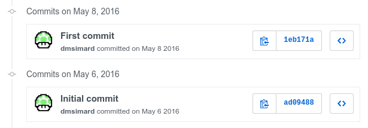

ARA is one year old, happy birthday ARA !

ARA's come a long way since the early prototypes.

The latest version, [0.13](https://dmsimard.com/2017/05/05/ara-ansible-run-analysis-0-13-is-out-and-its-awesome/), looks pretty awesome.
It even caught the eye of Michael DeHaan, the author of Ansible !



Let's go back in time to look at the humble beginnings of the project and some
of the important milestones that marked it's history this past year.

## An idea and a first prototype

I was beyond frustrated from trying to understand and troubleshoot Ansible
playbook runs at scale.

In the [OpenStack](https://www.openstack.org/) and
[RDO](https://www.rdoproject.org/) communities, we heavily leverage Ansible for,
amongst other things, continuous integration and testing jobs.

This meant part of my days were spent looking at tens of thousands of lines of
Ansible playbook output. The [human_log](https://gist.github.com/cliffano/9868180) callback
did not really help, it almost made matters worse by making the output even larger.

I got the idea for ARA on Friday **May 6th 2016**.
I started hacking that evening and after what was probably the most time I've
spent coding in a weekend, I had a prototype to share with close colleagues
and friends to validate the idea with the very first demo video.

The family was unfortunately neglected during that weekend !



 
## A very, very important contributor

One of those colleagues that ended up finding out about this prototype was
Lars Kellogg-Stedman ([@larsks](https://twitter.com/larsks)) and I owe a lot of
ARA's success to him today.

I don't consider myself a professional programmer by any stretch. Just a system
administrator passionate with building tools to help him in his job.

Lars came around with [code contributions](https://github.com/openstack/ara/commits?author=larsks)
for things I admittedly wasn't very good at.

A much better database schema, a better structure and framework for the flask web
application, a lot of great improvements to the callback plugin, UNIT TESTS
(of which there was probably none at the time) and I could keep going.

Lars was pretty busy with other projects at the time, which made me appreciate
so much more the time I spent discussing and developing ARA with him.

## ARA's first public appearance

On **May 21st 2016**, I shared ARA for the first time to the public in a blog post:
[ARA: An idea to store, browse and troubleshoot Ansible playbook runs](https://dmsimard.com/2016/05/21/ara-an-idea-to-store-browse-and-troubleshoot-ansible-playbook-runs/).

With this post came a second demo video:



 
## ARA becomes an OpenStack community project

We're **June 7th 2016**, [ARA is one month old and we've broken 200 commits already](https://dmsimard.com/2016/06/07/ara-one-month-and-200-commits-later/).

**June 8th 2016**, the [patch](https://review.openstack.org/#/c/321226/) to make ARA
an OpenStack community project merges and [github.com/openstack/ara](https://github.com/openstack/ara) is born.

To this day, I still keep the [github.com/dmsimard/ara](https://github.com/openstack/ara) repository around for
the sake of keeping the history of issues and pull requests that were created before ARA
joined the OpenStack community.

## A first OpenStack project starts using ARA

This came to me as a surprise, **[September 10th 2016](https://review.openstack.org/#/c/368345/)**,
a Kolla contributor implemented ARA to their integration tests in order to help them
figure out what's going on.

It was the [first official OpenStack project to use ARA](https://dmsimard.com/2016/11/09/visualizing-kolla-ansible-playbooks-with-ara/).
It all snowballed from there.

## A second OpenStack project tries ARA

After I [shared that Kolla used ARA](https://dmsimard.com/2016/11/09/visualizing-kolla-ansible-playbooks-with-ara/),
the OpenStack-Ansible project submitted a [patch](https://review.openstack.org/#/c/396565/)
to add it to their project on **November 11th 2016**.

[OpenStack-Ansible](https://github.com/openstack/openstack-ansible) was a very important early adopter of ARA, I owe them a lot.
OpenStack-Ansible simply operated at a much larger scale than we did at RDO.

They had thousands of tasks, many more results and this highlighted a lot of the assumptions
and flaws that ARA had at the time on operating at a large scale.

The UI and the performance were simply not suited for this kind of scale and we were able
to improve ARA a lot thanks to their feedback.

## ARA 0.10: A stable database and a first UI redesign

**December 2016**: [ARA 0.10 was the biggest release of ARA at the time](https://dmsimard.com/2016/12/01/ara-0.10-the-biggest-release-yet-is-out/).

It marked the first version where we felt the database schema would not move as much
and we could manage to not break users by implementing SQL migrations without too much
development overhead.

ARA 0.10 also shipped a first major UI redesign that would later be the foundation
of the interface ARA still uses today:



 
## ARA 0.11: ARA gets a logo and a new UI prototype

**[January 2017](https://github.com/openstack/ara/commit/0d5d0939a6b7a319d99acc1fb20d4ca282bd76ab)**,
Jason Rist ([@knowncitizen](https://twitter.com/knowncitizen)) came up with a logo for ARA !

With the icon:

Without the icon:

It looked awesome, I was really happy about it and it first made it's way in
[version 0.11](https://dmsimard.com/2017/02/13/announcing-the-ara-0.11-release/) of **February 2017**.

This is also around the time where I started experimenting with yet another redesign
for the user interface:


 
I feel like version 0.11 was the tipping point where users outside of the OpenStack
community *really* started getting interested in ARA.

I got plenty of interest over social media and started getting a lot of questions from users.



 
## ARA 0.12: A second UI redesign lands

**March 2017**, [ARA 0.12](https://dmsimard.com/2017/03/12/an-even-better-ansible-reporting-interface-with-ara-0-12/) is released
with a first iteration of the new user interface.

0.12 was the first version I felt confident recommending to users running Ansible at a large scale.
The UI redesign had those large scale users in mind while staying efficient and intuitive for small scale users.

It made browsing large amount of contents easy and straightforward and a lot of considerations went into making the interface as responsive as possible. It also very significantly improved one of the key features of ARA, the
[static HTML generation of the web application](https://ara.readthedocs.io/en/latest/usage.html#generating-a-static-html-version-of-the-web-application).

0.12 was also the first time I did a voiced demo of the ARA web interface to highlight its different features:


 
The amount of interest in ARA was growing from all over the place.
It was exciting, motivating but also a bit overwhelming.
This is about the time where I [reached out](http://lists.openstack.org/pipermail/openstack-dev/2017-March/114509.html)
to the OpenStack community to ask if they wanted to help developing ARA.

This call for help brought a few contributions but not as much as I would have hoped.
The fact that ARA is not my full time job means I have to spend a lot my 
personal time on the project but in the end, the user feedback is so rewarding
that I don't mind too much.

That said, I have to say I am extremely grateful to my employer, Red Hat, and my
managers who don't mind me spending time on ARA. Red Hat is awesome.

## An Ansible meetup talk and STICKERS !

**April 2017**, I was invited to speak at the [Ansible Montreal](https://www.meetup.com/Ansible-Montreal/events/238557821/)
meetup to talk about how Ansible users can extend Ansible with the help of plugins.

I totally had to make ARA stickers to bring to the meetup !



I did not bring enough stickers, though. It was a limited print and I wanted
to keep some for the next occasion. The stickers were gone in minutes !

The meetup was a great opportunity for me to highlight how ARA was taking advantage
of the plugin system in Ansible.



You can find the slides for that talk (*in french*) [here](http://redhat.slides.com/dmsimard/comment-personnaliser-et-etendre-ansible-module-actions-et-callbacks).

## ARA 0.13: Where we are today

**May 4th 2017**, there's lightsaber battles at the Red Hat Summit and [ARA 0.13 is released](https://dmsimard.com/2017/05/05/ara-ansible-run-analysis-0-13-is-out-and-its-awesome/).



ARA 0.13 improved on the foundation that 0.12 brought: bug fixes, new features, better performance
and a better and more streamlined UI.

There were so many improvements in 0.13 that I had to create yet another video demo
because the demo from 0.12 felt outdated.


 
The amount of interest in ARA with this new release is absolutely nuts.

Lots of comments on [Reddit](https://www.reddit.com/r/ansible/comments/69gkpz/hi_ransible_a_new_version_of_ara_ansible_run/) and
so many Twitter mentions, likes and retweets that I had to create a filter for
all the email notifications... My phone wouldn't stop ringing!

## The future: what's next

I could have never predicted what would become of this idea I had a year ago and
with that in mind, I definitely can't predict what the next year holds for ARA.

On the technical side of things, there are clear things we need to be doing to
further improve ARA.

ARA needs full python 3 compatibility, we need to have a better split of the
components (web application, API, client, CLI) and things like that.
I'm not a frontend developer and I'm convinced a professional UX developer could
make the UI so much better.

There's other very interesting opportunities to make the life of Ansible users
easier, not just with Ansible itself but through it's implementation in other
tools.

There are [questions](https://www.reddit.com/r/ansible/comments/69gkpz/hi_ransible_a_new_version_of_ara_ansible_run/dh6tiyt/)
with the eventual Open Source release of [Ansible Tower](https://www.ansible.com/tower)
and how we might see Tower and ARA working together.

ARA might also end up integrated in [some shape or form](https://review.openstack.org/#/c/444088/)
with [Zuul](http://status.openstack.org/zuul/), OpenStack's famous gate and pipelining
system.

Some people have also been requesting ARA to be a native plugin in [Molecule](https://github.com/metacloud/molecule/issues/728).

What's next ? Only time will tell !

Thanks to everyone that was involved with ARA so far, even as a user, your feedback
and questions have contributed to shaping ARA into what it is today.

See you next year :)
