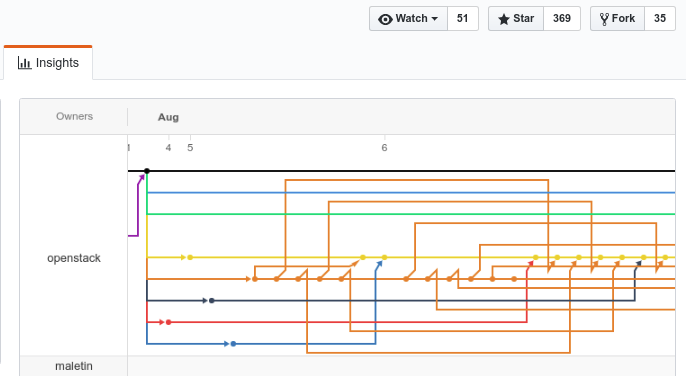
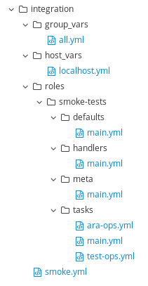
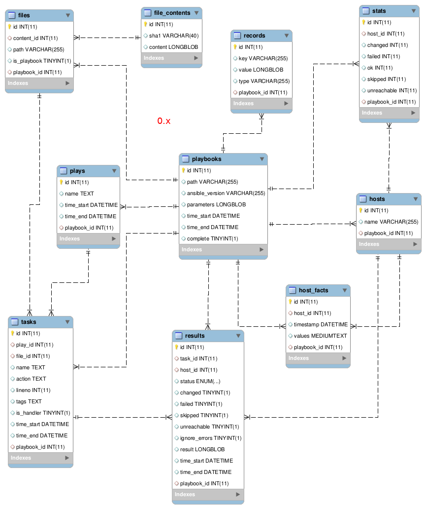
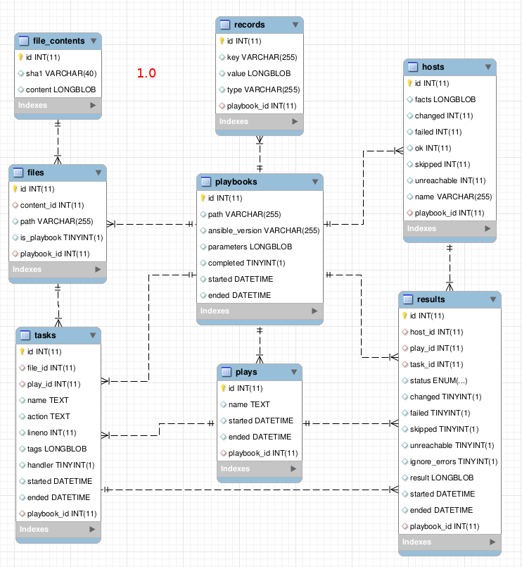

Back in [August](https://dmsimard.com/2017/08/16/whats-coming-in-ara-1.0/), I
posted about what was the roadmap for ARA 1.0 and why it was a very important
milestone for the project.

We're now almost in December and I said there would likely be a beta version
out by September. "What's going on ?", one might ask... A fair question.

There's definitely been progress and I could've been doing a better job at
communicating updates other than the [tweet](https://twitter.com/ara_community)
from time to time. It's time for a lengthy status update !

If you don't know what's ARA yet, you should be excited and read about what's
coming. Looking at a [video demo](https://www.youtube.com/watch?v=k3i8VPCanGo&list=PLyLLwe4-L1ETFVoAogQqpn6s5prGKL5Ty&t=12s&index=6)
will give you an idea of what the project can already do today.

This is a companion blog post to a talk given at the
[Ansible Montreal](https://www.meetup.com/Ansible-Montreal/) meetup, you can see
the slides (in french) [here](https://redhat.slides.com/dmsimard/ara-10-update).

If you'd like skip ahead and read the technical details about what's done
and what's not, feel free to scroll down a bit !

How is 1.0 being developed ?
============================

Time goes quickly when we're having fun, doesn't it ? 1.0 has been in progress
for a good four months already.

1.0 is being developed 100% in the open. If you're on [Slack or IRC](https://dmsimard.com/2017/08/27/new-ways-of-reaching-the-ara-community/)
you might have seen one of the notifications that is sent every time there is
a new patch submitted for code review.


You can also see all the patches as well
as the results for their unit and integration tests live on
[Gerrit](https://review.openstack.org/#/q/project:openstack/ara+branch:feature/1.0).

There's currently two git branches,
[master](https://github.com/openstack/ara/tree/master) and
[feature/1.0](https://github.com/openstack/ara/tree/feature/1.0). This allows
the development of version 1.0 to move forward without impacting the master
branch from which the 0.15.x series of releases are currently tagged from.

These branches have diverged a LONG time ago and are VERY different by now.



Keeping these two separate branches is great, but it also means that bugfixes
done in a branch that is applicable to the other branch should be backported.

Sometimes, this is easy, other times... it is not. Ever heard of merge
conflicts ? Maybe some code is gone, perhaps it has moved elsewhere or has
changed dramatically.

While I am trying to keep the master branch frozen for new features in order to
reduce the maintenance cost associated with this model, there are some things
that absolutely need to go through.. for example Ansible 2.4 support.

It was unrealistic to delay the support for Ansible 2.4 until ARA 1.0.

Ansible 2.4 changed (and [broke](https://github.com/ansible/ansible/pull/31200))
some internal methods ARA was relying on and there was no way to support it
properly unless we adapted to it.

This is compounded by the fact that ARA supports all stable releases of Ansible
in both Python 2 and Python 3 which have not reached their
[end of life](http://docs.ansible.com/ansible/latest/release_and_maintenance.html)
yet.

Hopefully we can ship this awesome 1.0 release soon so we no longer have to
maintain these two branches in parallel !

Why is this taking so long ?
============================

I'll be honest here: like probably many open source software maintainers, ARA
isn't my full time job. I'm not sure I would enjoy working on ARA full time
anyway. I enjoy system administration and architecture way too much.

Don't get me wrong, I'm quite passionate about ARA but it's ultimately a project
I created to make my job easier. I'm not making money with ARA, the fact that
it is useful to other people is super rewarding for me and that's enough.

I consider myself very privileged to be working at Red Hat which values
innovation driven by open source projects. While Red Hat grants me a certain
amount of freedom to work on ARA at my discretion, I recognize that my role is
very important for the [RDO](https://www.rdoproject.org/) and
[OpenStack](https://www.openstack.org/) communities and that's why I'll always
priorize spending the vast majority of my time there.

So far, ARA has been largely developed on my own time and I had to take a step
back for a bit.

I like to say that work isn't work when you're having fun -- I still believe
that, but I was just "working" too much for a while there.

I'll always be happy to receive and review patches from contributors in ARA.
If you'd like to help, you can get started by looking at the
[contribution documentation](http://ara.readthedocs.io/en/latest/contributing.html).

So when is it shipping ?
========================

I'd rather not try to plan for a date again like I did when I mentioned
September for a beta. It sucks because I failed to deliver and it sucks because
I am not managing the expectations of the users.

1.0 will ship when it is ready.
However, the primary purpose of 1.0 is to be the sandbox where we allow
ourselves to break all backwards compatibility.

If we're done merging all the features that we have an expectation would have
an impact on backwards (in)compatibility, it means we're nearing release.

I'm not going to delay the release indefinitely, things without impact that
aren't ready for 1.0 will ship later, that's all.

I'll stay vague on purpose: in the first half of 2018 ? If you end up having it
sooner, you can celebrate !

Let's move on to the status update of things.

The API is done (kind of)
========================

I took an iterative approach and there was definitely some trial and error
involved.

I decided to write a first version of the API by itself, only being validated
through purpose-built functional unit tests. When I started integrating it in
the different components of ARA.. there was some drawbacks. Me, as a user of
the API, did not feel comfortable leaving things as is.

The experiment was still worthwhile, though. It allowed me to "bootstrap" the
API from end to end and have an endpoint represent each component. The big
picture was there and we only needed to tweak things.

Some problems were [performance](https://github.com/flask-restful/flask-restful/issues/612)
related, others were around needing to do too many API calls to get one
particular bit of information and so on.



I drew some inspiration from the [Ansible AWX](https://github.com/ansible/awx)
API structure as well as from a Dropbox project which also uses Flask and
Flask-Restful, [Changes](https://github.com/dropbox/changes).. and went back to
the drawing board.

Today, the API itself is mostly finished.

The default callback, the [ara_record and ara_read modules](http://ara.readthedocs.io/en/latest/usage.html#using-the-ara-record-module)
have been re-written to consume the API rather than doing direct SQL queries.

The next step is to refactor the [command line interface](http://ara.readthedocs.io/en/latest/usage.html#querying-the-database-with-the-cli)
as well as the web application interface do to the same thing.

Using an API without compromising the user experience
=====================================================

Creating an API for an application that wasn't designed "API first" and then
re-writing it to consume that API was fun and challenging.

It was a learning experience and I'm pretty happy I was able to keep the result in line with the 
[project core values](http://ara.readthedocs.io/en/latest/manifesto.html):

- Simplicity is fundamental
- Do one thing and do it well
- Empower users to get their work done
- Don’t require users to change their workflows
- De-centralized, offline and standalone by default

**De-centralized, offline and standalone by default** ? With an API ? Yes.

I might end up explaining this implementation in it's own blog post eventually
but through a clever use of [Flask](http://flask.pocoo.org/), the built-in API
client in ARA can either communicate with an API endpoint over HTTP (REST) or
offline, locally through internal Flask calls.

**Don't require users to change their workflows**: This means ARA continues
to ship without a requirement to run a daemon, a web server or an API server.

``pip install ara``, set up the [Ansible callback](http://ara.readthedocs.io/en/latest/configuration.html#ansible),
run your Ansible playbook as you are used to and that's it. That's what it has
been since the project was created and I promise it will stay that way.

**Simplicity is fundamental** is a very important one for me. Adding an API
shouldn't make things complicated for the users... or the developers.

In fact, most of the work in ARA 1.0 isn't user-facing. It's a re-write of the
backend to move from the foundation the prototype had been built on more than
a year ago. The API will allow for faster development, make maintenance
easier and allow people to programmatically query ARA.

Again, simplicity is a core theme here, even in how the built-in API client
was designed to work.

Here's some quick examples that leverages the client:

```
# Import the "Playbook" API client
from ara.api.v1.playbooks import PlaybookApi

# Get a list of all playbooks
response, playbooks = PlaybookApi().get()

# Get the details of a specific playbook
response, playbook = PlaybookApi().get(id=1)

# Create a new playbook in the database
response, playbook = PlaybookApi().post(
  ansible_version="2.4.1.0",
  path="/home/user/ansible/playbooks/playbook.yml",
  parameters={
    "inventory": "/etc/ansible/inventory",
    "become": True,
    # ...
  }

# Import the "Result" API client
from ara.api.v1.results import ResultApi

# Get all failed results for a specific playbook
response, results = ResultApi().get(playbook_id=1,
                                    failed=True)
```

I mentioned earlier that the API had two ways of being exposed, one that was
offline (internal, no network or http involved) and one online (HTTP REST).

What you're not seeing in the background for the examples above is that no
matter if we're relying on the internal API or the HTTP REST API, the code
*and* the return values don't change.
A new configuration parameter, ``ARA_API_CLIENT`` which defaults to ``offline``,
can be set by users to ``online`` with a configurable API endpoint.

When using ``offline`` as the API client, you're limited to posting and querying
data on the host you are running Ansible from. This is perfect for most use
cases while keeping latency and overhead to a minimum.

When using ``online`` as the API client, you can host the web application and
the API endpoint elsewhere and aggregate data from multiple machines running
Ansible to a single location without having to share SQL database credentials.

Saving more files in ARA
========================

ARA currently saves playbook and role task files. That's pretty cool, but
what if we could also save group_vars, host_vars, defaults, meta, handlers
and other files ?

Consider it done in 1.0:



There will be a feature in order to selectively exclude files from being saved
if you happen to store sensitive information in them and would rather leave
those out.

An improved database schema
===========================

The main reason for breaking backwards compatibility and not providing an
upgrade path to 1.0 is the database schema.

**Before 1.0**



**1.0 (currently)**



It would have been quite a burden to handle SQL migrations for every change
that landed. Tables have been deleted, some fields have been renamed or even
moved to other tables.

Another issue is that the database model did not provide a
[metadata description](http://docs.sqlalchemy.org/en/latest/core/metadata.html).

This made it outright impossible to properly upgrade models on certain engines
such as [sqlite](https://github.com/miguelgrinberg/Flask-Migrate/issues/61)
because indexes and foreign keys may have been created without a name that we
can refer back to.

All in all, 1.0 is meant to be a clean slate with hopefully no "unfixable"
mistakes from a database perspective. If you're an expert at database models
and sqlalchemy, feel free to reach out, I'd love your input before this
version ships !

Still on the to-do list
=======================

There's been a lot of work on 1.0 already, but that doesn't mean we're done
yet.


Here's a high level overview of the big items still on the to-do list:

- **Input drivers**: The default callback will be folded back as an
  input driver in a structure that will easily allow us to implement other means
  of sending data to ARA. For example, we might want to send and process data
  asynchronously through a message bus such as RabbitMQ, MQTT or a buffer like
  Redis.

- **Output drivers**: The current ways of exporting data from ARA like HTML,
  junitXML and Subunit will be converted to output drivers in a generic
  structure in order to make it straightforward to implement new ways of
  exporting data. For example, this would allow us to create new drivers to
  send task data from ARA to InfluxDB, Graphite or Logstash which could be a
  nice addition to your Grafana or Kibana dashboards.

- **Decoupling components**: Splitting ARA components into subpackages would
  make it easier to install only what you need on the machines you want. It's
  silly to install the web application dependencies if you only want to use
  the callback. ``pip install ara`` should still reel everything in, but
  if you need just the callback, for example, there should be a package that
  does just that.

- **Playbook labels**: These would allow users to label their playbooks in
  order to display custom names in the web interface. For instance, you might
  want your playbook to be named "Install MySQL" instead of
  "/home/user/playbooks/playbook.yml". That's fair, let's do that.

- **Playbook logical groups**: It would be useful to be able to group playbooks
  together somehow. Pretend your deployment is really in fact 9 different
  playbooks, you might want to group them together under a name like
  "production deployment" so that you know you ran these together and look at
  them as one logical report instead of 9 different reports. Or maybe those 9
  playbooks are actually 3 for the development environment, 3 for the test
  environment and 3 for the production -- you will be able to group them as
  such.

On the wishlist
===============

I don't want to delay the release of ARA 1.0 for too long, but there are some
features I know would be very cool to add but are either complicated or would
delay the release further.

What's probably on the top of that list are persistent hosts. Ironically, the
prototype of ARA more than a year ago shipped with persistent hosts. What are
they ?

Right now, Ansible does not provide a way to uniquely identify each host and
this is a problem.

In puppet, for example, there is the concept of certificate signature between
a puppet agent and a puppet master. If a puppet agent shows up with the same
hostname as an existing machine, the certificate won't match and there will be
an error.

In the early days of ARA, we ran with the assumption that hosts were unique
across playbook runs. This means that if you had a server called "webserver"
and you ran 10 playbooks with that host, we could tally the results for that
particular host. You can see what it looked like in a very old video
[demo](https://www.youtube.com/watch?v=k3qtgSFzAHI&index=2&list=PLyLLwe4-L1ETFVoAogQqpn6s5prGKL5Ty).

The reason why we took that out is because your host, "webserver", can be
one server today and a completely different server tomorrow: Ansible won't
know the difference.
This kind of assumption ended up causing problems and we decided it was wise
to revisit this later.

I have some ideas around how we could implement this for ARA but the
implementation of persistent hosts is a lot of work that would have repercussions
on the database schema, the backend, the API, the CLI, the web interface..
everything.

What's on your wishlist ?
=========================

Do you have any items on your wishlist for ARA ? Let me know !

You can get in touch through [Twitter](https://twitter.com/dmsimard), [IRC
and Slack](https://dmsimard.com/2017/08/27/new-ways-of-reaching-the-ara-community/)
and you'll also find me lurking in [/r/ansible](https://www.reddit.com/r/ansible/).

Thanks for reading and see you around !

