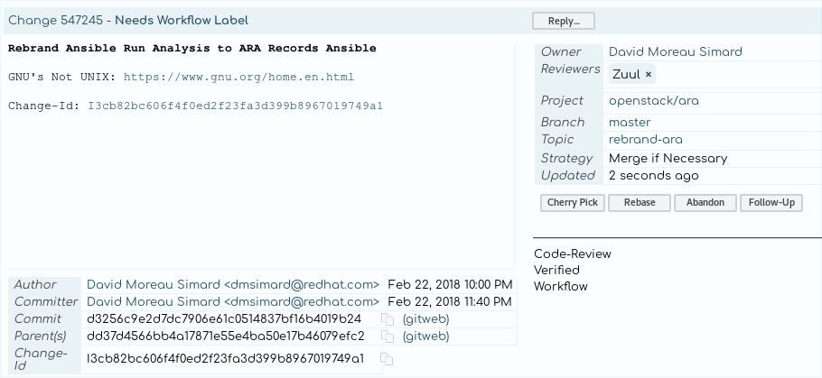

So I got an idea recently... Let's rebrand Ansible Run Analysis to ARA records
Ansible.

If you'd like to review and comment on the code change, you can do
so here: [https://review.openstack.org/#/c/547245/](https://review.openstack.org/#/c/547245/).

# Why ?

I watched the last season of [Sillicon Valley](https://www.hbo.com/silicon-valley) recently.
The series, while exaggerated, provides a humorous look at the world of startups.

I don't have any plans on creating a startup but I love that it makes you think
about things like needing a clever name or how you would do a proper "elevator"
pitch to get funding.

I'll take this opportunity to practice for fun.

ARA Records Ansible is Another Recursive Acronym.



## The "elevator" pitch

ARA Records Ansible is a project from the OpenStack community that makes it
easier to understand and troubleshoot your Ansible roles and playbooks.

- Do you run ``ansible-playbook -vv`` by default ?
- 50 000 lines of console output to look at ?
- How do you tell what changed ? Where ? Which task failed ?
- What parameters did you use in that ansible-playbook command yesterday ?
- What was the value of your host facts last week ?
- What code or Ansible version did your playbook run with a month ago ?

With ARA, you don't need to look at your 50 000 lines.
ARA tells you everything about your entire playbook execution history through an
intuitive self-hosted web interface, command line interface and soon, a full REST API.

## The "we're stuck in the elevator" pitch

ARA is a native [Ansible callback plugin](http://docs.ansible.com/ansible/devel/plugins/callback.html)
that transparently save everything about your playbook executions.

No matter if you're running Ansible from your laptop or from a server, this data
ends up in a database -- offline to sqlite by default.
If you prefer MySQL or PostgreSQL, that's cool too.

ARA makes your playbook execution history database available through:

- A web dashboard: Python [flask](http://flask.pocoo.org/) and [Patternfly](http://www.patternfly.org/) CSS (pretty!)
- A CLI client: Python [cliff](https://github.com/openstack/cliff) -- same client interface as the "[openstack](https://docs.openstack.org/python-openstackclient/latest/)" command (json or yaml output, etc.!)
- An API: Available in version 1.0 ([work in progress](https://dmsimard.com/categories/ara/)!)



# Learn more about the project

One of ARA's core features and values is its simplicity.
You can read about the other core values of ARA in the [project manifesto](https://ara.readthedocs.io/en/latest/manifesto.html).

To learn more about ARA, you can find the [open source code on GitHub](https://github.com/ansible-community/ara) or
watch this short video demo on YouTube:



# Chat with us

If you want to chat with us, we're on IRC in the #ara channel on [Freenode](https://webchat.freenode.net/)
and on [Slack](https://join.slack.com/t/ara-community/shared_invite/MjMxNzI4ODAxMDQxLTE1MDM4MDEzMTEtNzU1NTUwMTcyOQ).

The two are bridged with [slack-irc](https://github.com/ekmartin/slack-irc) so
everyone can talk together. It's pretty awesome.

# Stay up to date

If you'd like to stay up to date on what's coming in ARA 1.0, you can follow
the project on [Twitter: @ARecordsAnsible](https://twitter.com/ARecordsAnsible)
and [this blog](https://dmsimard.com/categories/ara/).

Thanks for reading, feel free to let me know if you have any questions !

- [@dmsimard](https://twitter.com/dmsimard)
