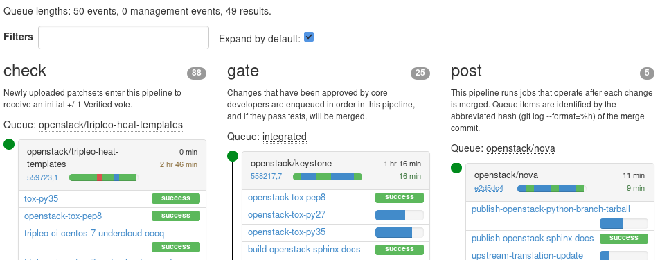
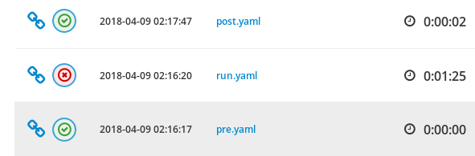

The [OpenStack](https://www.openstack.org/) community runs over 300 000 CI jobs
with [Ansible](https://www.ansible.com/) every month with the help of the
awesome [Zuul](https://zuul-ci.org/).



It even provides ARA reports for ARA's [integration test jobs](https://github.com/ansible-community/ara#contributing-testing-issues-and-bugs)
in a sort-of nested way. Zuul's Ansible ends up installing Ansible and ARA.
It makes my brain hurt sometimes... but in an awesome way.



As a core contributor of the infrastructure team there, I get to witness issues
and get a lot of feedback directly from the users.

[Static HTML report generation](https://ara.readthedocs.io/en/latest/usage.html#generating-a-static-html-version-of-the-web-application)
in ARA is simple but didn't scale very well for us. One day, I was randomly
chatting with Ian Wienand and he pointed out an
[attempt](https://review.openstack.org/#/c/120317/) at a WSGI middleware that
would serve extracted logs.

That inspired me to write something similar but for dynamically loading ARA
sqlite databases instead... This resulted in an awesome feature that I had not
yet taken the time to explain very well... until now.

*Excerpt from the [documentation](https://ara.readthedocs.io/en/latest/advanced.html#serving-ara-sqlite-databases-over-http)*

> To put this use case into perspective, it was “benchmarked” against a single job from the [OpenStack-Ansible](https://github.com/openstack/openstack-ansible) project:
> 
> - 4 playbooks
> - 4647 tasks
> - 4760 results
> - 53 hosts, of which 39 had gathered host facts
> - 416 saved files
>
> Generating a static report from that database takes ~1min30s on an average machine.
> The result contains 5321 files and 5243 directories for an aggregate size of 63MB (or 27MB recursively gzipped).
>
> This middleware allows you to host the exact same report on your web server just by storing the sqlite database which is just one file and weighs 5.6MB.
> 

This middleware can be useful if you're not interested in aggregating data in
a central database server like MySQL or PostgreSQL.

The OpenStack CI use case is decentralized: each of the >300 000 Zuul CI jobs
have their own sqlite database uploaded as part of the log and artifact collection.

There's a lot of benefits of doing things this way:

- There's no network latency to a remote database server: the first bottleneck is your local disk speed.
  - Even if it's a 5ms road trip, this adds up over hundreds of hosts and thousands of tasks.
  - Oh, and contrary to popular belief, [sqlite is pretty damn fast](https://sqlite.org/speed.html).
- There's no risk of a network interruption or central database server crash which would make ARA (and your sysadmins) panic.
- Instead of one large database with lots of rows, you have more databases ("shards") with fewer rows.
- Instead of generating thousands of files and directories, you're dealing with one small sqlite file.
- There's no database cluster to maintain, just standard file servers with a web server in front.

Another benefit is that you can easily have as many individual reports as
you'd like, all you have to do is to configure ARA to use a custom database
location.

When I announced that we'd be switching to the sqlite middleware on
[openstack-dev](http://lists.openstack.org/pipermail/openstack-dev/2018-March/128902.html),
I mentioned that projects could leverage this within their jobs and
OpenStack-Ansible was the first to take a stab at it:
[https://review.openstack.org/#/c/557921/](https://review.openstack.org/#/c/557921/).

Their job's logs now look like this:

```
ara-report/ansible.sqlite   # ARA report for this Zuul job
logs/                       # Job's logs
└── ara-report/             # ARA report for this OpenStack-Ansible deployment
    └── ansible.sqlite      # Database for this OpenStack-Ansible deployment
```

The performance improvements for the OpenStack community at large are
significant.

Even if we're spending 1 minute generating and transferring thousands of HTML
files... That's >300 000 minutes worth of compute that could be spent running
other jobs.

How expensive are 300 000 minutes (or 208 days!) of compute ?
What about bandwidth and storage ?

## Unfreezing ARA's stable release for development

The latest version of ARA is currently 0.14.6 and ARA was more or less in
feature-freeze mode while all the work was focused on the next major release,
"[1.0](https://dmsimard.com/2017/11/22/status-update-ara-1.0/)".

However, there is a growing amount of large scale users (me included!) that are
really pushing the current limitations of ARA and 1.0 (or 2.0!) won't be ready
for a while still.

I couldn't afford to leave performance issues and memory leaks ruin the
experience of a tool that would otherwise be very useful to them.

These improvement opportunities have convinced me that there will be a 0.15.0
release for ARA.

Stay tuned for the 0.15.0 release notes and another update about 2.0 in the
near future :)
