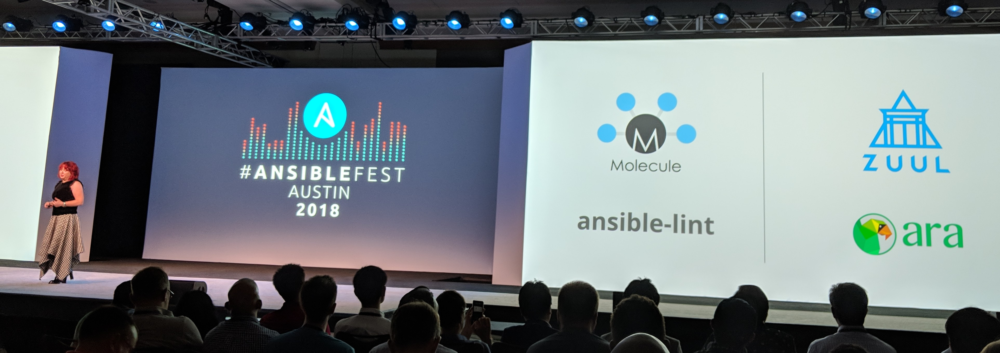

With two days of [AnsibleFest](https://www.ansible.com/ansiblefest) instead of
one this time around, we had 100% more time to talk about Ansible things !

I got to attend great sessions, learn a bunch of things, chat and exchange
war stories about Ansible, ARA, Zuul, Tower and many other things.

It was awesome and I wanted to take the time to share a bit about some of the
great Ansible community projects that were featured during the event.

At one point during the keynotes, the Ansible community lead, [Robyn Bergeron](https://twitter.com/robynbergeron),
talked about the community around Ansible with this slide:



It's possible this was the first time you were hearing about these projects.
Let me tell you about how awesome they are.

## ansible-lint and molecule

Before AnsibleFest, Ansible announced their intention to [adopt the ansible-lint and Molecule projects](https://www.reddit.com/r/ansible/comments/9j4de4/ansible_to_adopt_molecule_and_ansiblelint_projects/)
as part of a commitment to improve [Ansible Galaxy](https://galaxy.ansible.com/).



[ansible-lint](https://github.com/willthames/ansible-lint) helps you write consistent Ansible code for your roles and playbooks while adhering to best practices.
I think the first project I really started using ansible-lint on was on WeIRDO, a CI framework, as far back as [2015](https://github.com/rdo-infra/weirdo/commit/839b8a2e022b6a6f675dc9dcd40b6cf334a60741#diff-b91f3d5bd63fcd17221b267e851608e8) !

It's simple and it just works:

```
$ ansible-lint examples/example.yml
[ANSIBLE0004] Git checkouts must contain explicit version
examples/example.yml:15
Task/Handler: git check

[ANSIBLE0002] Trailing whitespace
examples/example.yml:35
    with_items: 

[ANSIBLE0006] git used in place of git module
examples/example.yml:24
Task/Handler: executing git through command
```

[Molecule](https://github.com/metacloud/molecule) provides a simple framework for easily and repetedly testing your roles and playbooks against different environments and operating systems.
There was a great talk last year about it by Elana Hashman from Rackspace: [Infrastructure Testing with Molecule](https://www.ansible.com/infrastructure-testing-with-molecule).

I haven't had the chance to try Molecule yet but here's what it looks like in practice on [Asciinema](https://asciinema.org/a/161977?speed=2&autoplay=1&loop=1):

<script src="https://asciinema.org/a/161977.js" id="asciicast-161977" async></script>

## Zuul

[Zuul](https://zuul-ci.org/) drives continuous integration, delivery, and deployment systems with a focus on project gating and interrelated projects.

The recordings aren't available yet but there were two sessions about Zuul at AnsibleFest last week:

- [Using Zuul CI/CD system to test Ansible Networking content](https://agenda.fest.ansible.com/SessionDetail.aspx?id=482140) by [Paul Belanger](https://twitter.com/pabelanger) and [Ricardo Carrillo Cruz](https://twitter.com/rcarrillocruz) from Red Hat
- [The Build is Never Broken](https://agenda.fest.ansible.com/SessionDetail.aspx?id=482019) by [Clint Byrum](https://twitter.com/spamaps) from GoDaddy

Zuul eventually replaced Jenkins for the [OpenStack](https://www.openstack.org/) community and if you're curious why, you can read more about that story in a short interview on the [SuperUser blog](http://superuser.openstack.org/articles/zuul-case-study-the-openstack-foundation/).

Zuul is awesome and let me try to give you a (long) elevator pitch of some of my favorite Zuul features:

- By design, Zuul is meant to gate patches against your projects. Zuul will not merge a patch to your project until all the required jobs are green.
- Your jobs in Zuul are written as Ansible roles and playbooks, letting you re-use your existing deployment code and leverage thousands of built-in Ansible modules and plugins natively out of the box.
- Zuul takes care of providing you with an Ansible inventory for your jobs by abstracting the logic of creating and destroying single-use virtualized or containerized environments.
- Every project managed by Zuul is independant and can manage their own jobs, inventories and pipeline configuration in tree.
- When evaluating a change or a pull request, Zuul will speculatively load and run the new configuration coming from the change. This means you can create a new job and iterate on it until it works without even merging any code or commits.
- Horizontally scalable for the vast majority of it's workloads, Zuul is highly available and is designed to consume multiple clouds and regions concurrently with the expectation that they will eventually fail.
- Zuul provides an implementation of [ARA Records Ansible](https://github.com/ansible-community/ara) for providing host and task granular results and metrics through an intuitive reporting web interface.



If you'd like to learn more about how [Zuul](https://zuul-ci.org/) works and what it does, I like to recommend the following two presentations by core developers of the project:

- [Zuul: Testing the future](https://www.youtube.com/watch?v=KXh0sh3ETkQ) by James Blair
- [Zuul v3 for gating](https://www.youtube.com/watch?v=6177329H4Tg) by Monty Taylor

You can chat with the Zuul users and developers on [IRC or on mailing lists](https://zuul-ci.org/community.html).

## ARA Records Ansible

[ARA Records Ansible](https://getara.org/) playbook runs and makes the recorded data available and intuitive for users and systems.

I created ARA a little over two years ago to make it easy for Ansible users to understand and troubleshoot what occurred during their playbook runs.

In a nutshell, ARA provides a native [Ansible callback plugin](https://docs.ansible.com/ansible/latest/plugins/callback.html) which saves everything to a local or remote database.
It then provides a command line interface as well as a web interface to query that database and provide detailed metrics and reporting for your Ansible playbooks.

ARA is notably implemented in Zuul and is used for reporting on more than [a million playbooks every month](http://superuser.openstack.org/articles/scaling-ara-ansible/) for the OpenStack community.
You can find the ARA source code mirrored on [GitHub](https://github.com/openstack?q=ara).

If you've never seen an ARA report before, I've recorded a live demonstration of the web interface a while back which is still accurate:


<br>

The upcoming major release, ARA 1.0, is all but a complete rewrite and has been more than a year in the making.
1.0 will feature a brand new REST API which will let users query and integrate their Ansible execution data in their tools and workflows.

The to-do list for 1.0 is shrinking and I'm really excited that we're getting to a point where people can start using it for testing purposes.
If you'd like to test 1.0 or contribute to ARA, please reach out to me on [IRC, Slack](https://github.com/ansible-community/ara#community-and-getting-help) or [Twitter](https://twitter.com/dmsimard)!