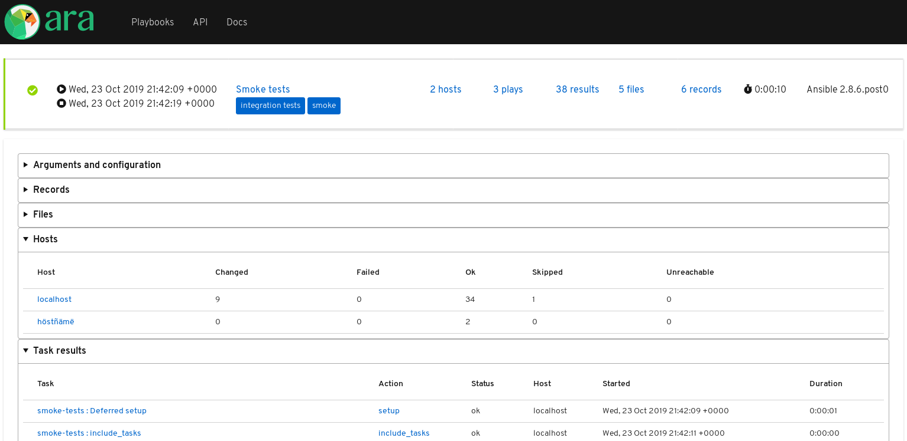

ARA 1.2.0 has been released !

You can refer to GitHub repository for the
[changelog](https://github.com/ansible-community/ara/releases/tag/1.2.0) as well
as the [full list of changes](https://github.com/ansible-community/ara/compare/1.1.0...1.2.0).

Here are some of the highlights in this new version:

## A simple built-in interface

Back by popular demand, ARA 1.2.0 re-introduces a built-in web interface
included by default with the API server.

This new lightweight and simple interface is designed to work without any
additional dependencies.

It is still very much a work in progress but we would love to hear about what
you think about it !

You can find a live demo available at [api.demo.recordsansible.org](https://api.demo.recordsansible.org/).

[ara-web](https://github.com/ansible-community/ara-web) will continue to evolve
over time but is in need of contributors knowledgeable in javascript to live up
to it's potential.

## Static HTML generation

It is once again possible to generate a static HTML version of the built-in
interface.
This static HTML version contains all the files you need to serve reports from
any web server.

The layout of the files has been slightly improved over ARA 0.x but it is still
unefficient at scale due to the amount of files generated.

Static reports can be created using ``ara-manage generate <path>``.

## Performance improvements

ARA has a performance impact when recording your playbooks but we hope to keep
this overhead as small as possible.

This release contains fixes to avoid doing unnecessary calls to the API during
the execution of Ansible playbooks and we're on the lookout to find other
improvement opportunities in the future.

## 1.3 preview: searching, sorting, filtering

The next version will feature improved search and add support for sorting and
filtering results through the API.

This means we will be able to implement these features in the built-in web
interface as well as ara-web.

For example, here is an early iteration of a search dialog in the built-in
interface:

## Want to try ARA ?

Have a look at the [quickstart](https://github.com/ansible-community/ara#quickstart) or
read the [installation](https://ara.readthedocs.io/en/latest/installation.html)
and [configuration](https://ara.readthedocs.io/en/latest/ansible-configuration.html)
documentation for more information.

## Want to contribute, chat or need help ?

ARA could use your help and we can also help you get started.
Please reach out !

The project community hangs out on [IRC and Slack](https://ara.recordsansible.org/community/).
