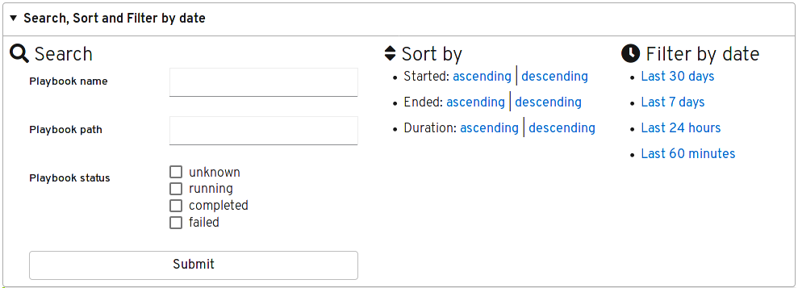

ARA 1.3.0 has been released !

You can refer to GitHub repository for the
[changelog](https://github.com/ansible-community/ara/releases/tag/1.3.0) as well
as the [full list of changes](https://github.com/ansible-community/ara/compare/1.2.0...1.3.0) since 1.2.

Here are some of the highlights in this new version:

## Required python version

Before ARA 1.3, it was required to run the API server under at least python 3.6
and above.

We've removed the requirement on python 3.6 by replacing a few
instances of [python f-strings](https://www.python.org/dev/peps/pep-0498/) by
a compatible string format.

This change will make it easier to run the API server on a wider range of
operating systems which include python 3.5.

## API improvements for searching, sorting and filtering

1.3 improves on the existing search functionality of the API and makes it
possible to sort and filter the results of your search.

Let's look at a few practical examples to demonstrate how this might be useful.

Pretend you'd like to search for playbooks that failed in the last 30 days and
have them ordered with the most recent first, you could construct your query
like so:

    /api/v1/playbooks?started_after=2019-11-03T09:57:36&status=failed&order=-started

If you want to find out which Ansible tasks took the longest to run, you can
sort by duration instead:

    /api/v1/tasks?order=duration

Or if you want to see which hosts are failing the most tasks:

    /api/v1/hosts?order=-failed

## Playbook index search

Some of the improvements to the API for this release were implemented in the
playbook index of the built-in interface:

We hope to bring similar functionality in the future for searching through
plays, tasks, results and hosts.

## Database pruning

Depending on your use case, you might not want to keep playbook reports in your
database forever.

1.3 introduces a new command, [ara-manage prune](https://ara.readthedocs.io/en/latest/ara-manage.html#ara-manage-prune),
which takes care of deleting playbooks and all of their resources if they are
older than a specified amount of days.

For example, the ``ara-manage prune`` command could be set up to run in a cron
to control the size of your database while keeping the amount of rows to a
minimum for steady performance.

## Want to try ARA ?

Have a look at the [quickstart](https://github.com/ansible-community/ara#quickstart) or
read the [installation](https://ara.readthedocs.io/en/latest/installation.html)
and [configuration](https://ara.readthedocs.io/en/latest/ansible-configuration.html)
documentation for more information.

## Want to contribute, chat or need help ?

ARA could use your help and we can also help you get started.
Please reach out !

The project community hangs out on [IRC and Slack](https://ara.recordsansible.org/community/).
