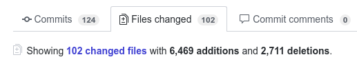
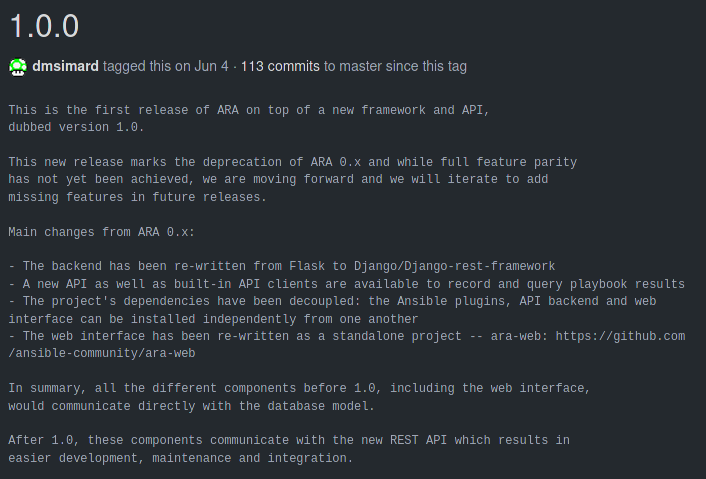
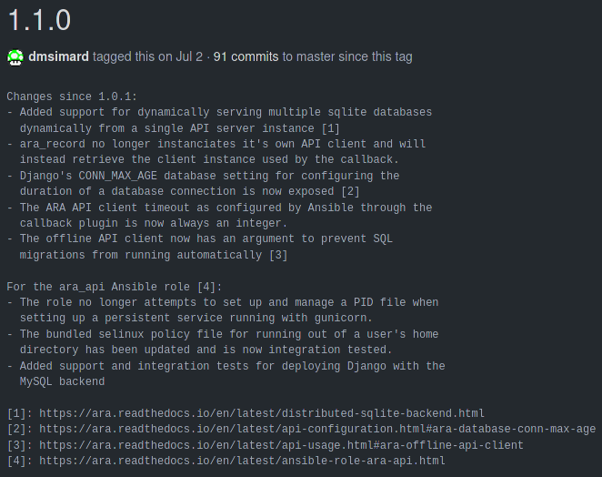
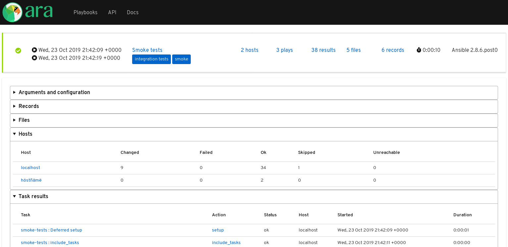
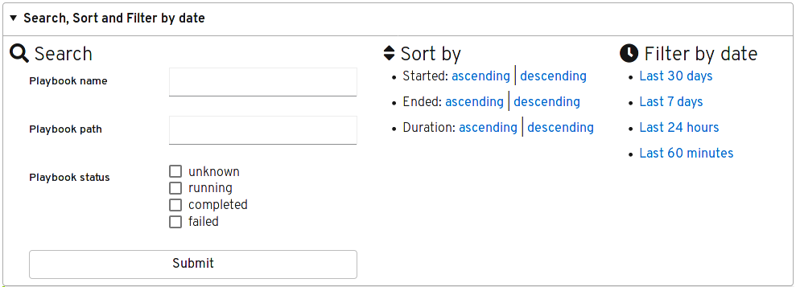

ARA has come a long way since I created it as a side project
[back in 2016](https://ara.recordsansible.org/blog/2016/05/21/an-idea-to-store-browse-and-troubleshoot-ansible-playbook-runs).

The end of 2019 is here and I thought this was a good opportunity to look back
at the progress of the project over the past year.

# The journey to finally release 1.0

ARA 0.x has been successful at recording Ansible playbook runs and providing
reporting capabitilies. However, it lacked -- amongst other things -- an API to
make it easier to integrate with other systems.

I've been talking about a version 1.0 for ARA as far back as
[August 2017](https://ara.recordsansible.org/blog/2017/08/16/whats-coming-in-ara-1.0)
and it has been quite an adventure since then.

First, I tried to extend the existing flask backend and retrofit an API with
flask-restful. It was challenging but was a great learning experience.

I ended up with something that worked for most of the resource endpoints by
[November 2017](https://ara.recordsansible.org/blog/2017/11/22/status-update-ara-1.0).

But then, nothing really happened for a while: I burned myself out.

Between work, family and different personal issues, I wasn't able to keep up
with the growth and pace of development of ARA anymore.

I maintained the project to keep it working with newer versions of Ansible with
the occasional bug fixes but that was it.

## A fork in the road

A fellow Red Hatter, Guillaume Vincent, eventually came up with a
[demonstration](https://github.com/ansible-community/ara/tree/a889a71bcd8d549b8c13d009a7ecb3266ad0b6d4)
of an API for ARA built on top of django and django-rest-framework,
coincidentally the same backend stack as AWX/Tower.

It worked and it turned out easier and simpler than what I had been working
on with flask.

This left me with a difficult question:

> Should I throw away over a hundred commits that I burned myself out on to
> start from scratch on a more robust framework that I know little about ?

After thinking about it and leaving the question lingering for a few months, I
eventually decided to bite the bullet and pursue development on top of django
and django-rest-framework instead.

For historical purposes, I tagged the
[tip of the flask-restful branch](https://github.com/ansible-community/ara/releases/tag/old-flask-1.0)
and then deleted it.

Guillaume and another contributor, Florian Apolloner, helped me along the
learning curve and little by little, we made progress towards what eventually
released as 1.0 more than 300 commits later.

And so, on June 4th 2019,
[ARA 1.0 was announced](https://ara.recordsansible.org/blog/2019/06/04/announcing-the-release-of-ara-records-ansible-1.0).

## 1.0 wasn't even feature complete

After almost two years of working part time on 1.0, throwing away more than a
hundred commits and working on some 300 more, it wasn't even feature complete
when it was released.

At this rate, it was going to take at least a few months to attain feature
parity with 0.x and land what I felt was missing.

Guillaume authored [ara-web](https://github.com/ansible-community/ara-web), a
javascript web interface to the API but couldn't keep contributing due to lack
of time and shifting priorities.

The new backend, API and API clients were working and in a state where they
could be useful to people.

Even if just for my own sanity, I couldn't keep those out of the hands of users
any longer while we worked on implementing missing features or made the web
interface pretty.

## But then, it got better

With 1.1 came iterative improvements and brought back the
[distributed sqlite database backend](https://ara.readthedocs.io/en/latest/distributed-sqlite-backend.html)
from [0.x](https://ara.readthedocs.io/en/stable-0.x/advanced.html).

Later, the [1.2 release](https://ara.recordsansible.org/blog/2019/11/06/announcing-the-release-of-ara-records-ansible-1.2)
brought back a simple built-in web reporting interface as well as static HTML
generation.

More recently, the
[1.3 release](https://ara.recordsansible.org/blog/2019/12/03/announcing-the-release-of-ara-records-ansible-1.3)
improved the API capabilities for searching, ordering and filtering queries
and brought these features to the built-in interface.

## About ara-web

Bringing back a built-in interface to ARA was a bit controversial because the
original intent was for ara-web to be the one frontend interface for reporting:
now there's two with varying levels of features.

ARA 0.x had a built-in interface but it also made the project depend on
many dependencies that weren't otherwise necessary.

On the other hand, requiring ara-web means that users need to install npm/node
javascript dependencies and run an API server in order to allow the hosted web
interface to connect to it.

It wasn't really a user experience improvement over what we had in 0.x.

So, for the time being, we've struck somewhere in the middle and settled on a
built-in interface without any javascript dependencies using simple django
templating.

I believe ara-web is an important project but requires the help of contributors
skilled in javascript to realize the project's potential.

# Looking to 2020

There's still many features and improvements to work on and I'd like to
do a better job at tracking them in the project's
[GitHub issues](https://github.com/ansible-community/ara/issues).

At a high level, here are some of the things I'd like to see implemented:

- [Allow pull requests on GitHub](https://github.com/ansible-community/ara-infra/issues/4)
- Re-introduce a CLI for querying the API and get results back
- Host-level web reporting view: browse results for a single host across multiple recorded playbooks
- [Support for recording diffs](https://github.com/ansible-community/ara/issues/29) (for ex: template tasks)
- [Support for recording adhoc commands](https://github.com/ansible-community/ara/issues/27)
- [Formalize a profiling/benchmark approach to identify performance improvement opportunities](https://github.com/ansible-community/ara-infra/issues/6)
- [Proper documentation for integration with AWX/Tower](https://github.com/ansible-community/ara/issues/24)
- [ARA is now packaged for Fedora](https://ara.recordsansible.org/blog/2019/11/22/ara-is-now-packaged-for-fedora) but it would be nice to have packages for other distributions as well

In the meantime, I've created a short [user survey](https://github.com/ansible-community/ara/issues/103)
and would appreciate hearing from you to help drive future development:



## Want to try ARA ?

Have a look at the [quickstart](https://github.com/ansible-community/ara#quickstart) or
read the [installation](https://ara.readthedocs.io/en/latest/installation.html)
and [configuration](https://ara.readthedocs.io/en/latest/ansible-configuration.html)
documentation for more information.

## Want to contribute, chat or need help ?

ARA could use your help and we can also help you get started.
Please reach out !

The project community hangs out on [IRC and Slack](https://ara.recordsansible.org/community/).
