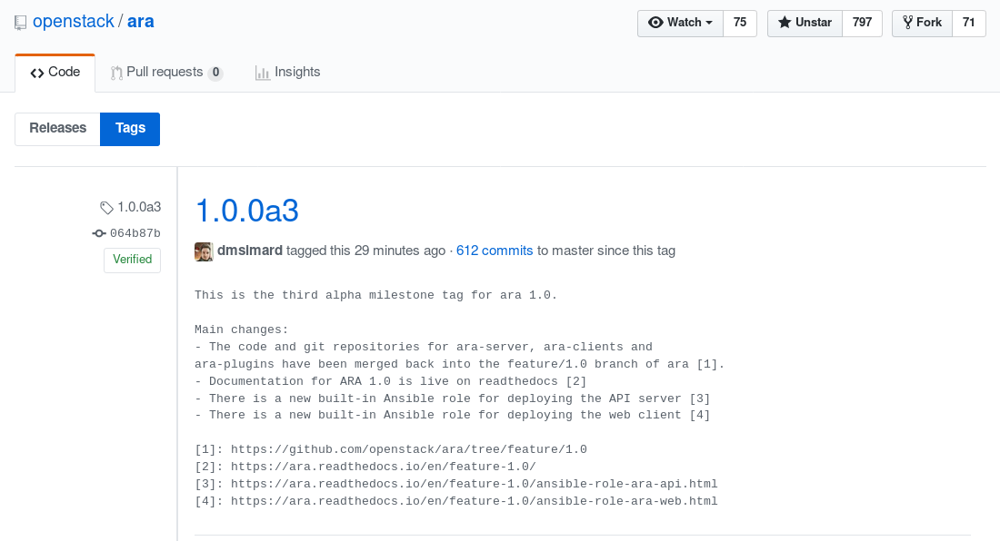

The release of ARA 1.0 draws closer with a third alpha milestone !

If there was a theme for this milestone it would be "back to basics".

In the previous [blog post](https://ara.recordsansible.org/blog/2019/01/16/introducing-new-projects-for-the-upcoming-1.0-release/),
I explained that ARA 1.0 was composed of several projects such as ``ara-server``,
``ara-plugins``, ``ara-clients``, ``ara-web`` and ``ara-infra``.

As a user, developer and maintainer of these projects myself, I realized that
the added complexity of keeping the projects separated did not provide enough
value to be worth it.

Things had to be simple because simplicity is a feature in ARA and failing to
be simple meant that we were not staying true to the project's [core values](https://ara.readthedocs.io/en/stable/manifesto.html).

## One repository instead of three

The ``ara-server``, ``ara-plugins`` and ``ara-clients`` projects have been
merged into a single repository and you'll be able to find them in the
[feature/1.0 branch](https://github.com/ansible-community/ara/tree/feature/1.0) of the
main ARA repository.

This means less burden for contributors and maintainers, for example:

- We're managing a single repository instead of three
- We no longer need to manage dependencies between the three projects
- We have one project to test, tag, release and contribute to
- Tests and CI no longer need to account for the projects being separated

By removing this overhead, the project becomes simpler to maintain which
frees up time to do other things.

For users, this means that there's only a single package with everything
included on PyPi instead of three and 1.0 is already lightweight in terms of
dependencies when compared to 0.x.

[ara-web](https://github.com/ansible-community/ara-web) will remain a standalone project
that provides a javascript web client to the API.

[ara-infra](https://github.com/ansible-community/ara-infra) will also remain since it's
for managing the infrastructure for the project -- including this blog post and
the Ansible playbooks to deploy it !

## Two built-in Ansible roles

ARA 1.0 will ship with two built-in Ansible roles:

- [ansible-role-ara-api](https://ara.readthedocs.io/en/feature-1.0/ansible-role-ara-api.html)
- [ansible-role-ara-web](https://ara.readthedocs.io/en/feature-1.0/ansible-role-ara-web.html)

These roles work are already in use to deploy
[api.demo.recordsansible.org](https://api.demo.recordsansible.org) as
well as [web.demo.recordsansible.org](https://web.demo.recordsansible.org) from
playbooks in [ara-infra](https://github.com/ansible-community/ara-infra/commit/a797094b61d3dd5f7ccb25849499489ed40cafea).

These roles are rough around the edges right now but they will evolve over
time to provide a framework for integration testing different ways of deploying
the new ARA API server as well as the web client interface.

# Beta ?

There's still some work to do before moving forward with what we'd call a beta.

For example, we need to iterate on [ara-web](https://github.com/ansible-community/ara-web)
and make sure the API is able to give it the information it needs.

Also, while the API and the API clients are nearing completion, we currently do
not yet have a CLI client which would allow users to query the API easily from
the command line (ex: ``ara playbook list``).

There's other things but I think those are definitely the ones that stand out
the most right now.

## In the meantime...

If you would like to contribute code, feedback, documentation or help test the
alpha milestones with us, please reach out !

Find us on [#ara](http://webchat.freenode.net/?channels=%23ara) on the freenode IRC
network and on [Slack](https://join.slack.com/t/arecordsansible/shared_invite/enQtMjMxNzI4ODAxMDQxLWU4MmZhZTI4ZjRjOTUwZTM2MzM3MzcwNDU1YzFmNzRlMzI0NTUzNDY1MWJlNThhM2I4ZTViZjUwZTRkNTBiM2I).
