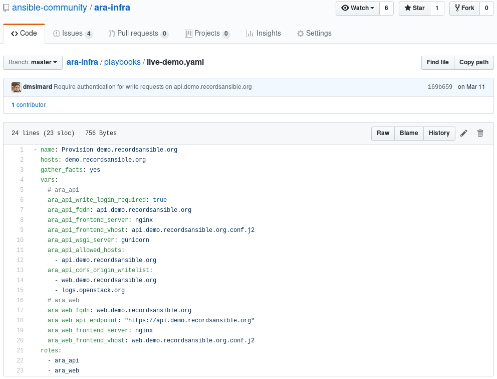

The first beta milestone for ARA 1.0 is out and ready for testing !

## Main changes since 1.0.0a4

- API: ``/api/v1/info`` has moved to ``/`` and ``/`` was improved with a link to the API index
- API: ``CORS_ORIGIN_WHITELIST`` now requires the scheme (http/https) as per [django-cors-headers](https://github.com/ottoyiu/django-cors-headers/blob/master/HISTORY.rst#300-2019-05-10)
- API: Playbook arguments are now provided when listing playbooks at ``/api/v1/playbooks``
- Clients: API clients now support authenticating with specified credentials
- Ansible roles: The ara_api role now supports using postgresql for the server database

## Packaging

The API server dependencies are now optional when installing ARA 1.0.
They can be installed by specifying the ``[server]`` extra requirement:

    # Note: --pre is required when installing an ARA 1.0 pre-release
    pip install [--pre] ara[server]

Local or offline usage of ARA 1.0 still requires the API server dependencies
installed but the server does not need to be running.

In addition, when using postgresql, the psycopg2 library can be installed by
specifying the ``[postgresql]`` extra requirement:

    pip install [--pre] ara[server,postgresql]

## Miscellaneous

- The code review and CI infrastructure was rebranded from OpenStack to [OpenDev](https://opendev.org/)
- The GitHub mirror is now available at https://github.com/ansible-community/ara
- Bug, issue and feature tracking have been moved to https://github.com/ansible-community/ara/issues

# Want to try it out ?

The live demos on [api.demo.recordsansible.org](https://api.demo.recordsansible.org/) and
[web.demo.recordsansible.org](https://web.demo.recordsansible.org/) have been
updated with this latest beta release.

If you want a quick start, you can have a look at the
[README](https://github.com/ansible-community/ara/tree/feature/1.0#quickstart)
or there is otherwise plenty of documentation available to get started:

- [Installing the 1.0 pre-release](https://ara.readthedocs.io/en/latest/installation.html)
- [Configuring Ansible to use ARA](https://ara.readthedocs.io/en/latest/ansible-configuration.html)
- [Configuring the ARA Ansible plugins](https://ara.readthedocs.io/en/latest/ara-plugin-configuration.html)
- [Customizing the API server configuration](https://ara.readthedocs.io/en/latest/api-configuration.html)
- [Setting up authentication and security considerations](https://ara.readthedocs.io/en/latest/api-security.html)
- [API endpoint documentation and object relationships](https://ara.readthedocs.io/en/latest/api-documentation.html)
- [How to use the API with the built-in API clients](https://ara.readthedocs.io/en/latest/api-usage.html)
- [Architecture and workflows: how ARA records data](https://ara.readthedocs.io/en/latest/architecture.html)

There are even built-in Ansible roles to help you set up an API server as well
as the new web interface:

- [ansible-role-ara-api](https://ara.readthedocs.io/en/latest/ansible-role-ara-api.html)
- [ansible-role-ara-web](https://ara.readthedocs.io/en/latest/ansible-role-ara-web.html)

In fact, these roles are the ones used to deploy the live demos on
[api.demo.recordsansible.org](https://api.demo.recordsansible.org/) and
[web.demo.recordsansible.org](https://web.demo.recordsansible.org/):

You'll find the Ansible roles in the [source repository](https://github.com/ansible-community/ara/tree/feature/1.0/roles).

# Help wanted

ARA is a free and open source community project and it needs help from users and
contributors for maintenance, new features and improvements.

As a user, your feedback is invaluable to know if the project is living up to
your expecations.

Was the documentation clear ? Did you encounter an issue when trying ARA ?
Do you have an idea for a new feature ?
Join the community and chat with us on
[IRC or on Slack](https://ara.recordsansible.org/community/) to tell us about it !

As a contributor, there is a wide range of things we could use your help for.

Issues and features are now tracked on GitHub for [ara](https://github.com/ansible-community/ara/issues?q=is%3Aopen+is%3Aissue+-label%3A0.x),
[ara-web](https://github.com/ansible-community/ara-web/issues) as well as
[ara-infra](https://github.com/ansible-community/ara-infra/issues).

The API server is based on [Django](https://www.djangoproject.com/) and
[django-rest-framework](https://www.django-rest-framework.org/) while the web
interface is a stateless javascript application built with
[patternfly](https://www.patternfly.org/) and [react](https://reactjs.org/).

With this beta release, the API should be mostly settled although we are
interested in feedback for the database model if you are familiar with Django.

The web interface needs the most love but hey, it works and it is able to query
the API successfully.

All commits are code reviewed, unit and integration tested before being
merged to the project.



If you have time to contribute, I can help point you in the right direction to
get started.

You can find me as ``dmsimard`` on IRC, Slack and [Twitter](https://twitter.com/dmsimard).

# After the beta: releasing ARA 1.0

Installing and configuring ARA 1.0 is very similar to ARA 0.x on purpose.

However, there will be no support for upgrading an existing 0.x database to 1.0.
The backend and database model is now based on Django instead of Flask and
everything was essentially re-written from scratch.

If you are currently using ARA 0.x, now might be a good time to make sure you
don't upgrade unexpectedly:



It is important to note that 1.0 will be released without full feature parity
with 0.x. It was a tough decision to make but I'm convinced the new API provides
too much value to keep it unreleased while we implement the missing features.

Namely, these are some of the things that will be missing from the 1.0 release:

- A command-line interface (ex: ``ara playbook list``)
- Generating and exporting data (ex: ``ara generate html``, ``ara generate junit``)
- An approach for large scale distributed environments similar to [sqlite over http in 0.x](https://superuser.openstack.org/articles/scaling-ara-ansible/)

If these features are important to you, we could use your help to port them to
use the new API or you can hold out until they are eventually shipped in a
future release.

Otherwise, the plan is to have a sufficient amount of users try out the beta
to see if there are any bugs or gaps we might have missed and then tag the
release once these have been resolved.

Soon ™
