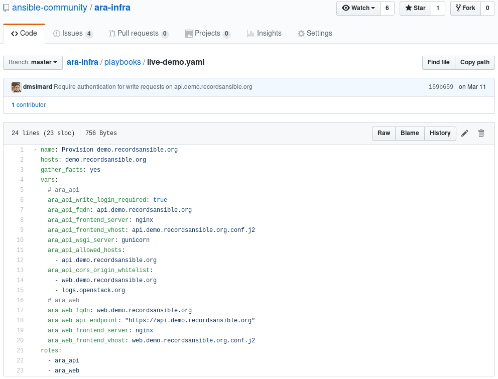

After more than three years since the creation of the project, we are excited
to announce that the version 1.0 of ARA Records Ansible is now available.

This new release marks the deprecation of ARA 0.x and while full feature parity
has not yet been achieved, we are moving forward and we will iterate to add
missing features in future releases.

## Main changes from ARA 0.x

- The backend has been re-written from Flask to Django/Django-rest-framework
- A new API as well as built-in API clients are available to record and query playbook results
- The project's dependencies have been decoupled: the Ansible plugins, API backend and web interface can be installed independently from one another
- The web interface has been re-written as a standalone project: [ara-web](https://github.com/ansible-community/ara-web)

In summary, all the different components before 1.0, including the web interface,
would communicate directly with the database model.

After 1.0, these components communicate with the new REST API which results in
easier development, maintenance and integration.

# Want to try it out ?

If you want a quick start, you can have a look at the
[README](https://github.com/ansible-community/ara/tree/feature/1.0#quickstart)
or there is otherwise plenty of documentation available to get started:

- [Frequently asked questions](https://ara.readthedocs.io/en/latest/faq.html)
- [Installing ARA](https://ara.readthedocs.io/en/latest/installation.html)
- [Configuring Ansible to use ARA](https://ara.readthedocs.io/en/latest/ansible-configuration.html)
- [Configuring the ARA Ansible plugins](https://ara.readthedocs.io/en/latest/ara-plugin-configuration.html)
- [Customizing the API server configuration](https://ara.readthedocs.io/en/latest/api-configuration.html)
- [Setting up authentication and security considerations](https://ara.readthedocs.io/en/latest/api-security.html)
- [API endpoint documentation and object relationships](https://ara.readthedocs.io/en/latest/api-documentation.html)
- [How to use the API with the built-in API clients](https://ara.readthedocs.io/en/latest/api-usage.html)

You might also want to take a look at ARA features such as
[playbook names and labels](https://ara.readthedocs.io/en/latest/playbook-names-and-labels.html)
and the [ara_record action module to record arbitrary data](https://ara.readthedocs.io/en/latest/ara-record.html).

There are even built-in Ansible roles to help you set up an API server as well
as the new web interface:

- [ansible-role-ara-api](https://ara.readthedocs.io/en/latest/ansible-role-ara-api.html)
- [ansible-role-ara-web](https://ara.readthedocs.io/en/latest/ansible-role-ara-web.html)

In fact, these roles are the ones used to deploy the live demos on
[api.demo.recordsansible.org](https://api.demo.recordsansible.org/) and
[web.demo.recordsansible.org](https://web.demo.recordsansible.org/):

You'll find the Ansible roles in the [source repository](https://github.com/ansible-community/ara/tree/feature/1.0/roles).

# What comes after 1.0

In the near future, what is now the default master branch in the ara git
repository will be relocated to stable/0.x and future dot releases to ARA 0.x,
if necessary, will be tagged from that branch.

The feature/1.0 branch will be relocated to the master branch and will be where
development will happen moving forward.

A similar switch will happen for the documentation on
[ara.readthedocs.org](https://ara.readthedocs.org) where the default
documentation will now be for 1.0 and the 0.x documentation will remain available.

Afterwards, the plan is to keep iterating on ara as well as ara-web and resume
a regular pace of release.

# Questions ? Issues ? Feedback ?

Please reach out !

You can find us on [IRC and Slack](https://ara.recordsansible.org/community/)
and issues are tracked on GitHub for both
[ara](https://github.com/ansible-community/ara/issues) and
[ara-web](https://github.com/ansible-community/ara-web/issues).
