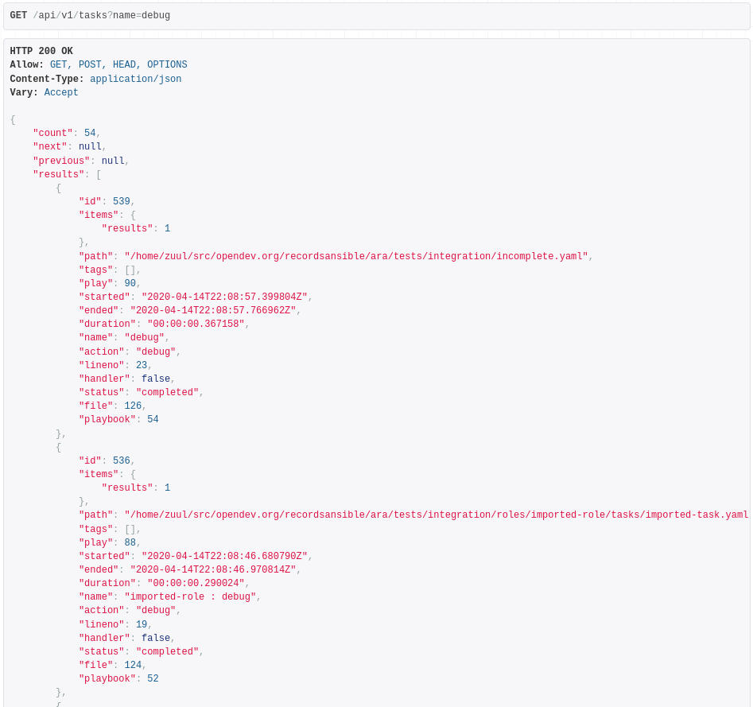
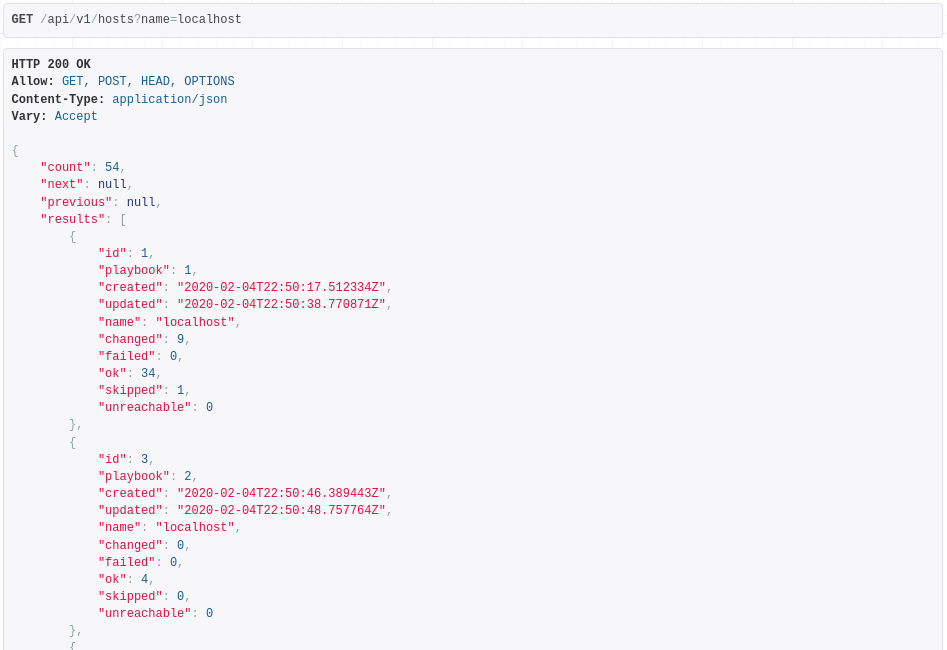
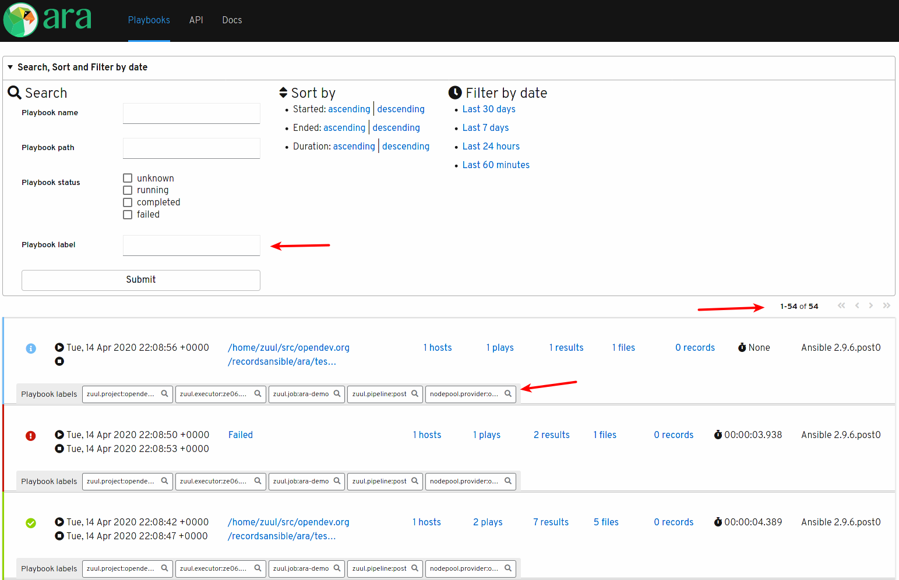

1.4 is a significant milestone for the project and adds a number of new features, bugfixes and improvements.
The first release candidate, 1.4.0rc1, is available for testing from PyPi with ``pip install --pre ara[server]``.

Here you can find some of the highlights for this upcoming release.

For the full list of changes, see the [changelog](https://github.com/ansible-community/ara/releases/tag/1.4.0rc1) or the
[list of commits since 1.3.2](https://github.com/ansible-community/ara/compare/1.3.2...1.4.0rc1).

## The ara_api Ansible role now supports EL8

The [ara_api Ansible role](https://github.com/ansible-community/ara/tree/master/roles/ara_api) can be used to deploy
and configure a production-ready ARA API server and, in fact, this is the role used to deploy the
[live demo](https://github.com/ansible-community/ara-infra/blob/master/playbooks/live-demo.yaml) on [api.demo.recordsansible.org](https://api.demo.recordsansible.org).

The role is also used to integration test ARA itself and we've added support for deploying on EL 8 so we can have
test coverage on the new release of CentOS and RHEL.

## Added support for searching plays, tasks and hosts by name

Ansible doesn't have the concept of playbook names but ARA provides the ability to [give them one](https://ara.readthedocs.io/en/latest/playbook-names-and-labels.html).
This allows users to make playbook reports easier to find later.

Plays and tasks will usually have a name, not just to make [ansible-lint](https://github.com/ansible/ansible-lint/blob/master/lib/ansiblelint/rules/TaskHasNameRule.py)
happy but because it improves readability and helps explain and describe what your roles and playbooks do.

And then, you have hosts which, of course, will have a hostname or inventory name.

In 1.4, you can now use the API to search for those names and the implementation supports partial matches so you can
search for only part of the name if need be.

In practice, it's as simple as the following:

- ``<api-server>/api/v1/playbooks?name=production``
- ``<api-server>/api/v1/plays?name=deploy``
- ``<api-server>/api/v1/tasks?name=apache``
- ``<api-server>/api/v1/hosts?name=localhost``

So, for example, if you have a task that suddenly started failing, you can search for the task and compare it easily
with previous results of the same task:

Searching for a host name instead would allow you to see the results for this host across different Ansible playbook
runs:

## Playbook labels

ARA allows users to configure labels for their Ansible playbook runs.

For example, perhaps you run playbooks on different environments (prod, dev, staging) or maybe you run them on different
clouds or for different customers.
Another use case might be to tag your playbook after the control node that ran the playbook if you run playbooks from
multiple locations and want to categorize them.

Tagging your playbooks with labels is meant to make your life easier if you want to find specific playbook runs later on.

It was always intended for playbook labels to be searchable but support for it didn't land until now.
Now, you can search playbook reports matching only a specific label, making it simple for you to find what you're
looking for:

- ``<api-server>/api/v1/playbooks?label=production``

In addition, it is now possible to specify default labels which results in all playbooks being run to be tagged after
a set of default labels on top of the labels that might already be specified by the playbooks.

You can learn more about how to use labels from the [documentation](https://ara.readthedocs.io/en/latest/playbook-names-and-labels.html).

## Reversed default sort order for playbooks, plays, tasks and results

Although it might be logical to return data and display elements in a chronological order, it also means that what
users are interested in is probably at the bottom because a failure typically means the end of a playbook.

When browsing a list of playbooks, you'd also want the most recent playbook at the top rather than buried at the end
of the last page.

So, in 1.4, we've reversed the default sort order so that the most recent items will be returned at the top instead
of at the bottom.

## Querying the ARA API from inside playbooks with new plugins: ara_playbook and ara_api

``ara_playbook`` is a new action plugin which queries the ARA API and returns data for the playbook that is currently running.
``ara_api`` is a new free-form lookup plugin to query anything and everything from the API.

These new plugins are still somewhat experimental and might be rough around the edges but they are designed to be
convenient and flexible.
They do not require users to specify API endpoints or credentials since they are retrieved by the callback plugin to
record playbooks already.

You can use these for anything you'd like but to inspire your creativity, a common use case from users is to craft
web URLs that lead directly to the playbook report.
However, in order to be able to do that, you need the playbook ID and this is where ``ara_playbook`` can help.

Another example: ARA is using these plugins to test itself during [integration tests](https://github.com/ansible-community/ara/blob/master/tests/integration/lookups.yaml):

- name: Assert playbook properties
  hosts: localhost
  gather_facts: yes
  vars:
    ara_playbook_name: ARA self tests
    ara_playbook_labels:
      - lookup-tests
  tasks:
    - name: Retrieve the current playbook so we can get the ID
      ara_playbook:
      register: playbook_query

    - name: Recover data from ARA
      vars:
        playbook_id: "{{ playbook_query.playbook.id | string }}"
      set_fact:
        playbook: "{{ lookup('ara_api', '/api/v1/playbooks/' + playbook_id) }}"
        tasks: "{{ lookup('ara_api', '/api/v1/tasks?playbook=' + playbook_id) }}"
        results: "{{ lookup('ara_api', '/api/v1/results?playbook=' + playbook_id) }}"

    - name: Assert playbook properties
      assert:
        that:
          - playbook.name == 'ARA self tests'
          - "playbook.labels | selectattr('name', 'search', 'lookup-tests') | list | length == 1"
          - playbook.ansible_version == ansible_version.full
          - playbook_dir in playbook.path
          - "'tests/integration/lookups.yaml' in playbook.path"
          - "playbook.files | length == playbook['items']['files']"
          - "playbook.hosts | length == playbook['items']['hosts']"
          - "playbook.plays | length == playbook['items']['plays']"
          - "tasks.results | length == playbook['items']['tasks']"
          - "results.results | length == playbook['items']['results']"


You can read more about these new plugins in the [documentation](https://ara.readthedocs.io/en/latest/ara-api-lookup.html).

## Preventing sensitive files from being saved

ARA will keep a unique, compressed copy of your playbook, role and variable files so that contextual data is readily
available when you browse and troubleshoot your playbooks.

If you happen to have sensitive information in those files, you might not want ARA to pick them up so your credentials
or secrets are not exposed.

In 1.4, you can now use the ``ARA_IGNORED_FILES`` or the ``ignored_files`` setting in the ansible.cfg configuration for
ARA in order to do just that.
This is a list of patterns and if a file matches a pattern, it will not be saved.

So, if your Ansible vault files are named something like ``secrets.vault.yaml``, you could use ``secrets`` or ``vault`` as the pattern.

This is a configuration for the callback plugin, not the API server.
For more information on how to configure the callback plugin behavior, see the [documentation](https://ara.readthedocs.io/en/latest/ara-plugin-configuration.html).

## Improvements to the bundled web reporting interface

[ara-web](https://github.com/ansible-community/ara-web) has unfortunately not been worked on but the bundled simple
reporting interface has been improving slowly but surely.

In 1.4, the playbook report list is now paginated and not only has the label display been improved but you can also
search for playbooks by labels now that it is supported by the API:

# That's it for now !

There's plenty of work left to do but it will need to be in a future release !

## Want to try ARA ?

Have a look at the [quickstart](https://github.com/ansible-community/ara#quickstart) or
read the [installation](https://ara.readthedocs.io/en/latest/installation.html)
and [configuration](https://ara.readthedocs.io/en/latest/ansible-configuration.html)
documentation for more information.

## Want to contribute, chat or need help ?

ARA could use your help and we can also help you get started.
Please reach out !

The project community hangs out on [IRC and Slack](https://ara.recordsansible.org/community/).
