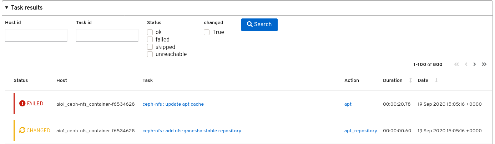
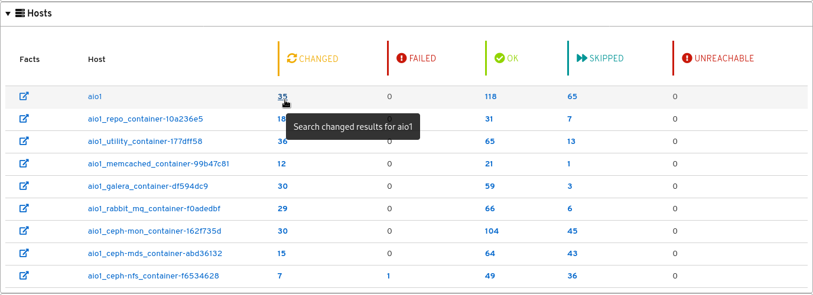
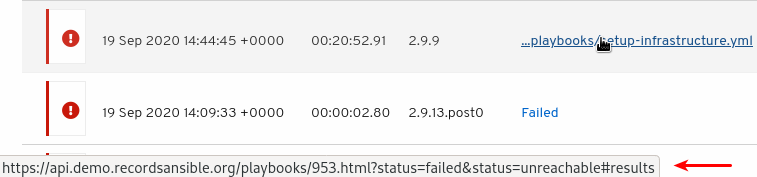
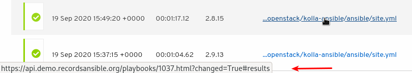

ARA 1.5.0 as well as 1.5.1 (due to a release issue with PyPi) have been released !

For the full list of changes, see the [changelog on GitHub](https://github.com/ansible-community/ara/releases/tag/1.5.0)
as well as the list of [commits since 1.4.3](https://github.com/ansible-community/ara/compare/1.4.3...1.5.0).

The changelogs and release notes for every version are now included in the [documentation](https://ara.readthedocs.io/en/latest/changelog-release-notes.html) as well.

Check out the refreshed [getting started](https://ara.readthedocs.io/en/latest/getting-started.html) guide to try it out.

Here you can find some of the highlights for this new release.

## A new CLI

1.5.0 ships with a brand new CLI client included in the main ara package.
The ``ara`` command allows you to query and browse playbooks and their results right from your terminal or shell scripts.

You can see the full list of commands and their arguments in the [documentation](https://ara.readthedocs.io/en/latest/cli.html#cli-ara-api-client)
but here's a brief demonstration:

*Note: [View directly on asciinema for full-width resolution](https://asciinema.org/a/361348)*

<script id="asciicast-361348" src="https://asciinema.org/a/361348.js" async></script>

## Search and pagination for playbook results

Before 1.5.0, clicking on a playbook to view its details would return all of its task results which could
take a long time to load and render for playbooks with thousands of results.

Results are now paginated which vastly improves performance and a search form was added to the task results panel:



The new search feature was implemented in the hosts summary table so clicking on a host or it's number of tasks for a
status will automatically search for it:



We're also leveraging this new search feature in the playbook list in order to send users to the most relevant results.

For failed playbooks, we'll search for "failed" and "unreachable" results:



And for successful playbooks, we'll search for "changed" results:



## Playbook expiration

Over time, ara could end up with a lot of playbooks stuck in the "running" status because they were interrupted or
would otherwise never complete for a variety of reasons.

In 1.5.0, this is addressed by the implementation of a new status: "expired".
Combined with the new [ara expire](https://ara.readthedocs.io/en/latest/cli.html#ara-expire) command, playbooks stuck
in the "running" status can now be set to be expired after a specified amount of hours.

ara doesn't have the machinery for doing or scheduling tasks automatically (yet?) but ``ara expire`` can be set up to run
from a cron like [ara playbook prune](https://ara.readthedocs.io/en/latest/cli.html#ara-playbook-prune) to keep the database tidy.

## Argument labels

A new feature for the callback plugin, [argument labels](https://ara.readthedocs.io/en/latest/ansible-plugins-and-use-cases.html#cli-argument-labels),
will automatically label playbooks after specified CLI arguments if they are used.

For example, if ``--check`` is used and set up as an argument label, the playbook will be tagged with ``check:True`` or ``check:False`` if it wasn’t.

In practice, this could be used to filter out dry-run playbooks where ``--check`` was used by searching for the ``check:False`` label.

## Improved accuracy of task result durations

Before 1.5.0, ara would use the start date of a task as the start date of a result which is accurate when running
against a single host but isn't when running against many hosts.

Now, ara will leverage a new callback hook introduced by Ansible in 2.8: ``v2_runner_on_start``.
This new hook gives ara the ability to set an accurate start time for each individual result instead of the task start date.

This is probably best explained by data and so given a list of 16 hosts with a simple ``sleep 5`` command task:

Before, notice how the duration increments over time:

```
> ara result list --playbook 139
+------+---------+----------+------+------+----------------------------------+-----------------+
|   id | status  | playbook | task | host | started                          | duration        |
+------+---------+----------+------+------+----------------------------------+-----------------+
| 8930 | changed |      139 | 2249 | 3618 | 2020-09-22T18:31:45.341429-04:00 | 00:00:05.375164 |
| 8931 | changed |      139 | 2249 | 3619 | 2020-09-22T18:31:45.341429-04:00 | 00:00:05.461543 |
| 8932 | changed |      139 | 2249 | 3620 | 2020-09-22T18:31:45.341429-04:00 | 00:00:05.543938 |
| 8933 | changed |      139 | 2249 | 3621 | 2020-09-22T18:31:45.341429-04:00 | 00:00:05.591372 |
| 8934 | changed |      139 | 2249 | 3622 | 2020-09-22T18:31:45.341429-04:00 | 00:00:05.680345 |
| 8935 | changed |      139 | 2249 | 3623 | 2020-09-22T18:31:45.341429-04:00 | 00:00:10.729962 |
| 8936 | changed |      139 | 2249 | 3624 | 2020-09-22T18:31:45.341429-04:00 | 00:00:10.814804 |
| 8937 | changed |      139 | 2249 | 3625 | 2020-09-22T18:31:45.341429-04:00 | 00:00:10.898037 |
| 8938 | changed |      139 | 2249 | 3626 | 2020-09-22T18:31:45.341429-04:00 | 00:00:10.945747 |
| 8939 | changed |      139 | 2249 | 3627 | 2020-09-22T18:31:45.341429-04:00 | 00:00:11.625386 |
| 8940 | changed |      139 | 2249 | 3628 | 2020-09-22T18:31:45.341429-04:00 | 00:00:16.018695 |
| 8941 | changed |      139 | 2249 | 3629 | 2020-09-22T18:31:45.341429-04:00 | 00:00:16.105170 |
| 8942 | changed |      139 | 2249 | 3630 | 2020-09-22T18:31:45.341429-04:00 | 00:00:16.142404 |
| 8943 | changed |      139 | 2249 | 3631 | 2020-09-22T18:31:45.341429-04:00 | 00:00:16.218316 |
| 8944 | changed |      139 | 2249 | 3632 | 2020-09-22T18:31:45.341429-04:00 | 00:00:16.871900 |
| 8945 | changed |      139 | 2249 | 3633 | 2020-09-22T18:31:45.341429-04:00 | 00:00:21.239833 |
+------+---------+----------+------+------+----------------------------------+-----------------+
```

After, each result is just about 5 seconds as we'd expect:
```
> ara result list --playbook 138
+------+---------+----------+------+------+----------------------------------+-----------------+
|   id | status  | playbook | task | host | started                          | duration        |
+------+---------+----------+------+------+----------------------------------+-----------------+
| 8928 | changed |      138 | 2247 | 3616 | 2020-09-22T18:31:28.360197-04:00 | 00:00:05.253263 |
| 8927 | changed |      138 | 2247 | 3615 | 2020-09-22T18:31:23.371466-04:00 | 00:00:05.242033 |
| 8926 | changed |      138 | 2247 | 3614 | 2020-09-22T18:31:23.282524-04:00 | 00:00:05.250794 |
| 8925 | changed |      138 | 2247 | 3613 | 2020-09-22T18:31:23.233829-04:00 | 00:00:05.261368 |
| 8924 | changed |      138 | 2247 | 3612 | 2020-09-22T18:31:23.149980-04:00 | 00:00:05.263708 |
| 8923 | changed |      138 | 2247 | 3611 | 2020-09-22T18:31:23.097555-04:00 | 00:00:05.265748 |
| 8922 | changed |      138 | 2247 | 3610 | 2020-09-22T18:31:18.100408-04:00 | 00:00:05.276012 |
| 8921 | changed |      138 | 2247 | 3609 | 2020-09-22T18:31:18.013179-04:00 | 00:00:05.272808 |
| 8920 | changed |      138 | 2247 | 3608 | 2020-09-22T18:31:17.966802-04:00 | 00:00:05.271878 |
| 8919 | changed |      138 | 2247 | 3607 | 2020-09-22T18:31:17.883465-04:00 | 00:00:05.271284 |
| 8918 | changed |      138 | 2247 | 3606 | 2020-09-22T18:31:17.834228-04:00 | 00:00:05.269352 |
| 8915 | changed |      138 | 2247 | 3603 | 2020-09-22T18:31:12.522211-04:00 | 00:00:05.448203 |
| 8917 | changed |      138 | 2247 | 3605 | 2020-09-22T18:31:12.518245-04:00 | 00:00:05.587271 |
| 8914 | changed |      138 | 2247 | 3602 | 2020-09-22T18:31:12.514695-04:00 | 00:00:05.372740 |
| 8913 | changed |      138 | 2247 | 3601 | 2020-09-22T18:31:12.510951-04:00 | 00:00:05.328318 |
| 8916 | changed |      138 | 2247 | 3604 | 2020-09-22T18:31:12.505742-04:00 | 00:00:05.512212 |
+------+---------+----------+------+------+----------------------------------+-----------------+
```

# That's it for now !

There's plenty of work left to do but it will need to be in a future release !

## Want to contribute, chat or need help ?

ARA could use your help and we can also help you get started.
Please reach out !

The project community hangs out on [IRC and Slack](https://ara.recordsansible.org/community/).

You can also stay up to date on the latest news by following [@RecordsAnsible](https://twitter.com/RecordsAnsible) on Twitter.
