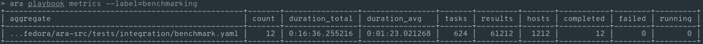
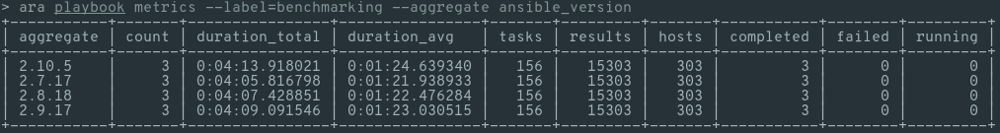
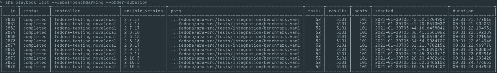
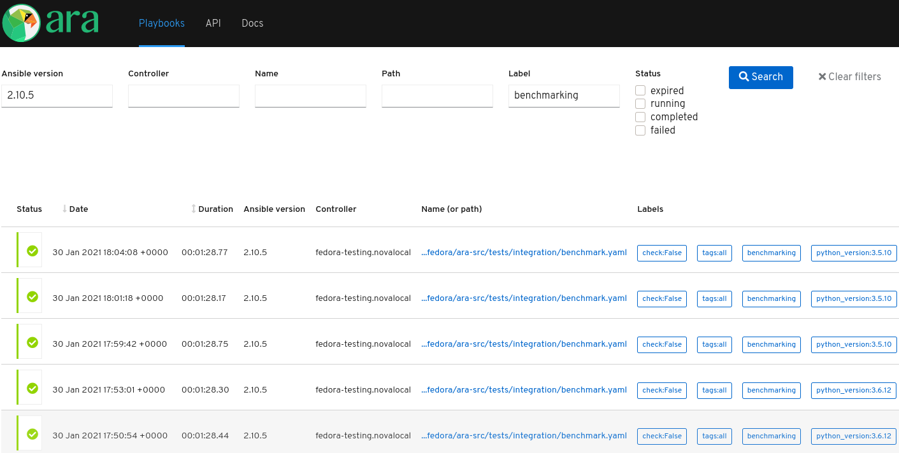

In the last [blog post](https://ara.recordsansible.org/blog/2020/11/01/benchmarking-ansible-and-ara-for-fun-and-science/),
we benchmarked the overhead of recording Ansible playbooks with ara.

There's still room for improvement but we measured that it was on the right track and getting better.
The data is useful so we can tell whether we're improving things or making them worse !

ara 1.5.5 adds support for searching playbooks by Ansible versions and I was curious what kind of data we would get if we ran our benchmark with different versions of Ansible.
I also want to see if there is a difference when running ansible and ara under different python versions.

Feel free to skip to the end for the numbers but if you're interested in the setup and how we'll run the benchmark, read on !

## About the API server

By default, you don't need to run an API server and ara records Ansible playbooks to a local sqlite database.
It looks like this:

```bash
# Install Ansible and ARA (with API server dependencies) for the current user
python3 -m pip install --user ansible "ara[server]"

# Configure Ansible to use the ARA callback plugin
export ANSIBLE_CALLBACK_PLUGINS="$(python3 -m ara.setup.callback_plugins)"

# Run an Ansible playbook
ansible-playbook playbook.yaml

# Use the CLI to see recorded playbooks
ara playbook list

# Start the built-in server to browse recorded results
ara-manage runserver
```

For the purpose of our tests, we'll record the results to a running API server where you can also browse the results: [demo.recordsansible.org](https://demo.recordsansible.org).

It is a single VM with 8 cores, 16GB of RAM and backed by SSD storage running:

- CentOS 8 with python 3.6.8
- ara 1.5.5rc1
- gunicorn backend (django app, ara api server)
- nginx reverse proxy with ssl termination (thanks [letsencrypt](https://letsencrypt.org/)!)
- mysql (mariadb 10.3) backend: so we are less prone to [sqlite database lock contention](https://github.com/ansible-community/ara/issues/195) (threading is hard)

It's deployed with the [ara collection](https://github.com/ansible-community/ara-collection) and the [geerlingguy.mysql](https://github.com/geerlingguy/ansible-role-mysql) role for the mysql backend.

## Running our playbooks

Keeping latency to a minimum, we'll run our ``ansible-playbook`` commands from a Fedora 33 VM on the same hypervisor.
The goal this time around isn't to measure performance with remote hosts so we'll run a specified number of Ansible tasks to run against "fake" hosts which are, in fact, localhost.

This is what it looks like:

```bash
# Install Ansible and ARA (without API server dependencies) for the current user
python3 -m pip install --user ansible==$ANSIBLE_VERSION ara

# Set a modest amount of forks and configure Ansible to use the ARA callback plugin
export ANSIBLE_FORKS=50
export ANSIBLE_CALLBACK_PLUGINS="$(python3 -m ara.setup.callback_plugins)"

# Configure the ARA callback to know where the API server is located and enable threading
export ARA_API_CLIENT="http"
export ARA_API_SERVER="https://demo.recordsansible.org"
export ARA_API_USERNAME="*****"
export ARA_API_PASSWORD="*****"
export ARA_CALLBACK_THREADS=4

# Put our version of python into an ara label so we can easily search for this playbook later
export python_version=$(python3 -c "import sys; print(f'{sys.version_info.major}.{sys.version_info.minor}.{sys.version_info.micro}')")
export ARA_DEFAULT_LABELS="benchmarking,python_version:${python_version}"

# Retrieve the benchmark playbook and run it against localhost
git clone https://github.com/ansible-community/ara ara-src
cd ara-src
time ansible-playbook -i "localhost," -c local tests/integration/benchmark.yaml \
    -e "benchmark_host_count=100" \
    -e "benchmark_task_count=50"
```

## Ansible versions with python 3.9.1

I ran the playbook three times for each of the following Ansible versions:

- ``ansible-base==2.10.5`` (provided when installing ``ansible==2.10.6``)
- ``ansible==2.9.17``
- ``ansible==2.8.18``
- ``ansible==2.7.17``

I haven't put effort into testing ansible<=2.6 for now because it was broken and has been out of maintenance since 2019.

In total, ara recorded 12 playbooks and ran 624 tasks across 1212 hosts for a total of 61212 results:



All versions performed quite comparably, though we can see a trend from 2.7.17 through 2.10.5:



More specifically:



It's an interesting trend: with everything else being equal, it's getting a little bit slower for each series of releases.
We'll have to find out later if this continues when [ansible-core 2.11](https://docs.ansible.com/ansible/devel/roadmap/ROADMAP_2_11.html) succeeds to ansible-base 2.10.

## Python versions with ansible-base 2.10.5

What about if we run the same experiment by switching python versions instead ?

In a similar pattern, I ran the playbook three times for each of the following Python versions:

- 3.9.1 (default on Fedora 33 and already done when we tested different Ansible versions)
- 3.8.7
- 3.7.9
- 3.6.12
- 3.5.10

I did this by installing ara and ansible under specific interpreters, for example:
``/usr/bin/python3.8 -m pip install --user ansible==2.10.6 ara``



# Putting it all together

I haven't tested all possible combinations but we have a lot of data already with the 24 playbooks we've run.
Picking the middle result out of three tests because the truth probably lies somewhere between the best and the worst run, we have the following table:

| ansible | python 3.9.1 | python 3.8.7 | python 3.7.9 | python 3.6.12 | python 3.5.10 |
|---------|--------------|--------------|--------------|---------------|---------------|
| 2.10.5  |     01:24.77 |     01:23.92 |     01:27.04 |      01:28.30 |      01:28.75 |
| 2.9.17  |     01:23.03 |              |              |               |               |
| 2.8.18  |     01:22.42 |              |              |               |               |
| 2.7.17  |     01:21.93 |              |              |               |               |

Again, these results are quite comparable but there is a small difference.

Considering this is a synthetic benchmark that only iterates over 5000 debug tasks, it isn't representative of real-life scenarios where the performance can vary on a number of factors including but not limited to:
- the latency between hosts
- whether you're tunneling through a jump box or bastion host (instead of running from the jump box/bastion host itself)
- the performance of the tasks themselves (like how long it takes to install a package from a mirror, start a service, etc)
- tuning ansible forks, ssh pipelining, etc

More things to benchmark in the future maybe !

In the meantime, if you'd like to explore the data from these benchmarks, they're available on [demo.recordsansible.org](https://demo.recordsansible.org/?label=benchmarking).

Until then, if you have any questions or would like to chat, come join us on [Slack or IRC](https://ara.recordsansible.org/community/) !

o/