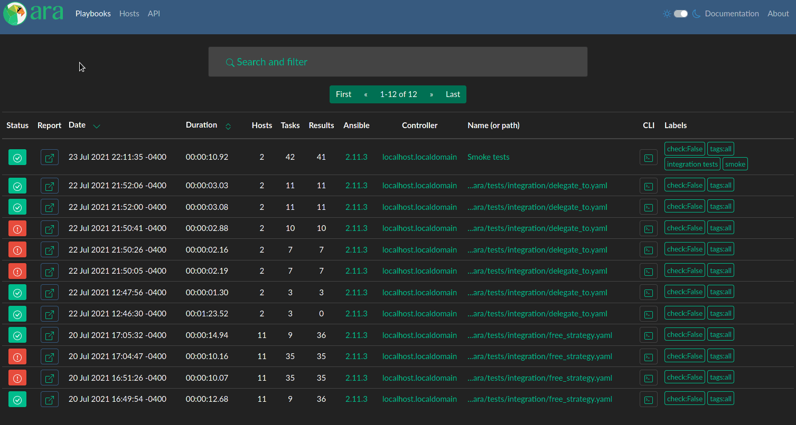
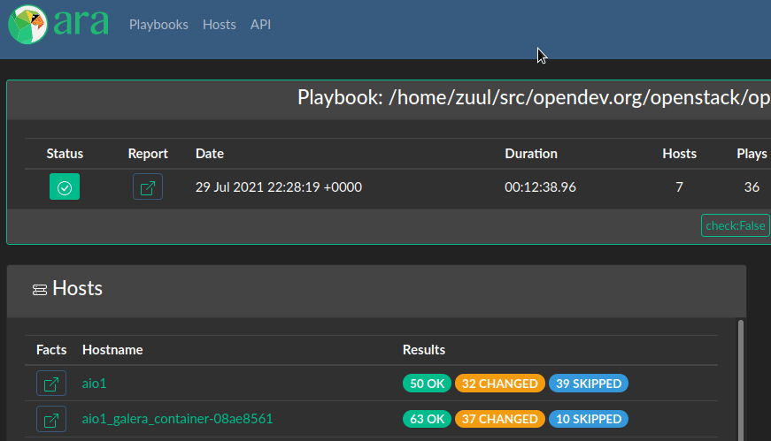

ARA 1.5.7 has been released and you can try it out with the [getting started guide](https://ara.readthedocs.io/en/latest/getting-started.html)
or by checking out the live demo at https://demo.recordsansible.org.

For the full list of changes, see the [changelog on GitHub](https://github.com/ansible-community/ara/releases/tag/1.5.7)
as well as the list of [commits since 1.5.6](https://github.com/ansible-community/ara/compare/1.5.6...1.5.7).

You can also catch up on the changelog and release notes for every version until now in the
[documentation](https://ara.readthedocs.io/en/latest/changelog-release-notes.html).

1.5.7 features a brand new "hosts" page to browse and search playbook reports by host as well as fixes and improvements.

## A new hosts page

ARA has always been about recording Ansible playbooks and then providing an interface to make them easier to understand
and troubleshoot.

While individual playbook reporting has been helpful and useful, there was no easy way to visualize the results of a
specific host across multiple playbook runs -- until now.

With 1.5.7, you can browse either the latest playbook report for each host or search through all playbook reports for
a specific host:

### Under the hood

There are reasons why visualization per host had not been implemented until now and it has been a work in progress
(on and off) since 2019!



In a nutshell: each host are unique per-playbook in ara because ara does not have a mechanism provided by Ansible to
uniquely identify each host. In other words, a host named "localhost" could be entirely different machines across
multiple playbook runs.
This is in contrast to the puppet world, where there is a certificate exchange authentication between an agent and puppetmaster.

We have made peace with that and settled on making it easier to search playbook reports based on the name of the host.
Depending on your use case and the previous explanation above, this may sometimes result in false positives but,
generally speaking, the name of the host should be sufficient and reliable enough to provide the functionality.

We already had a ``/api/v1/hosts`` endpoint but it returned every host for every playbook.
We needed a way to identify the latest playbook that ran for a specific host name without relying on potentially
expensive and slow database queries -- especially at scale.

1.5.7 introduces a new endpoint contributed by [@hille721](https://twitter.com/hille721) to help us with that:
``/api/v1/latesthosts``.

Even though it is read-only, it implements the necessary machinery under the hood to keep an up-to-date list of the
latest playbook that ran for each host name with little to no performance impact.

With this last piece of the puzzle in place, it's how the new hosts page can display the latest playbook for each host
by default while allowing you to include all playbook reports if necessary.

## Recording when delegate_to is used in a task

[noonedeadpunk](https://github.com/noonedeadpunk) from the [openstack-ansible](https://github.com/openstack/openstack-ansible)
project rightfully pointed out in an [issue](https://github.com/ansible-community/ara/issues/282) that ara did not
record whether a task had been delegated and if so, to which host.

This could end up being confusing and lead users into thinking a task ran on the "original" host while, in fact, it ran
on another host because it had been delegated.

There were some bumps along the way while implementing this due to how Ansible passes the delegation information down
to the callback but starting with 1.5.7, task delegation is now recorded and will be displayed in the interface:

## Recording playbooks with the "free" strategy

Ansible has different [strategies](https://docs.ansible.com/ansible/latest/user_guide/playbooks_strategies.html) to run
playbooks where the default is linear and executes each task for every host before moving on to the next task.

The free strategy, on the other hand, executes tasks on hosts as fast as it can without waiting for each host to complete
a task before moving on to the next one.

[jhampson-dbre](https://github.com/jhampson-dbre) described in an [issue](https://github.com/ansible-community/ara/issues/260)
how ara would end up recording tasks and their results out of order when running with the free strategy.

Thankfully, he's also contributed an improvement to make sure ara associated the right results with the right tasks in 1.5.7 !

This was a large gap in our integration testing coverage and we've added a test specifically about the free strategy to
make sure we don't end up breaking this in the future.

# That's it for now !

There's plenty of work left to do but it will need to be in a future release !

## Want to contribute, chat or need help ?

ARA could use your help and we can also help you get started.
Please reach out !

The project community hangs out on [IRC and Slack](https://ara.recordsansible.org/community/).

You can also stay up to date on the latest news and development by following [@RecordsAnsible](https://twitter.com/RecordsAnsible) on Twitter.
