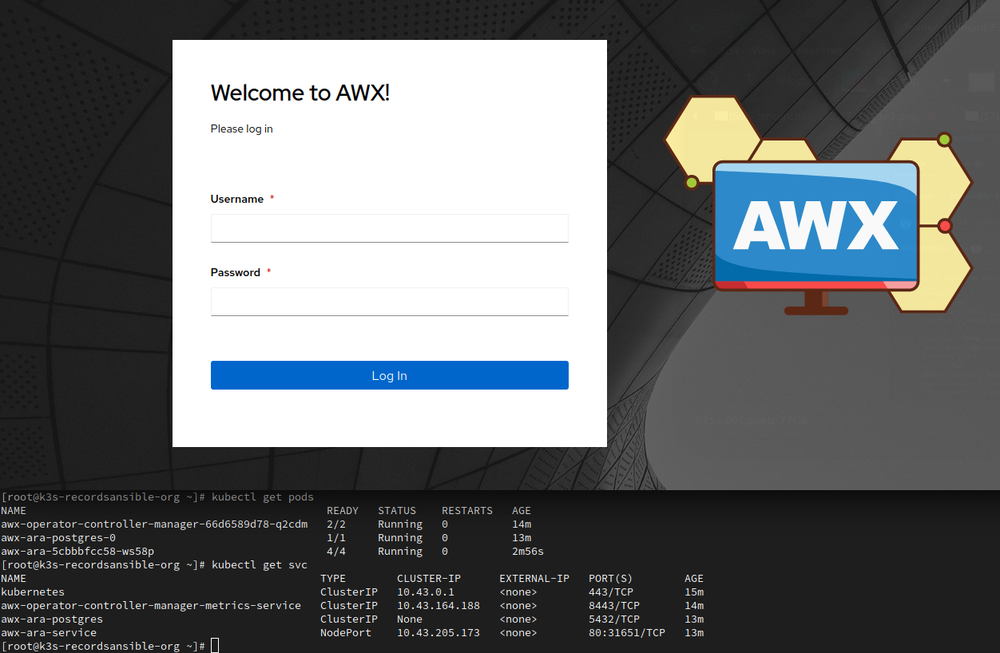
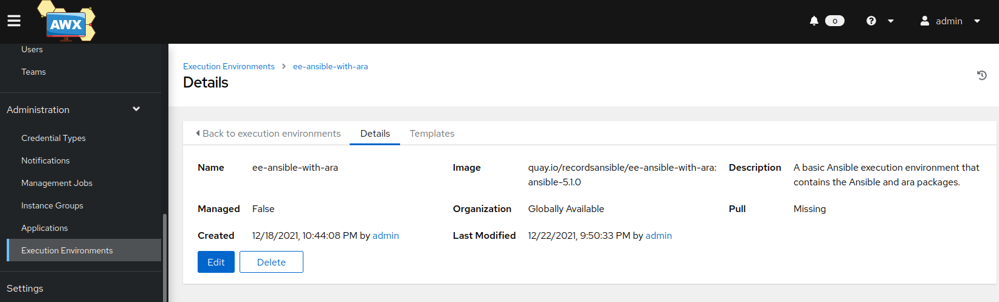
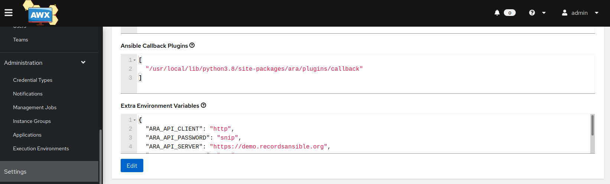
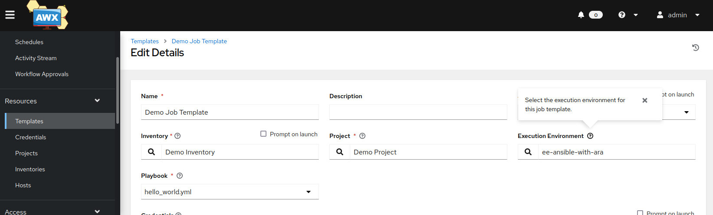
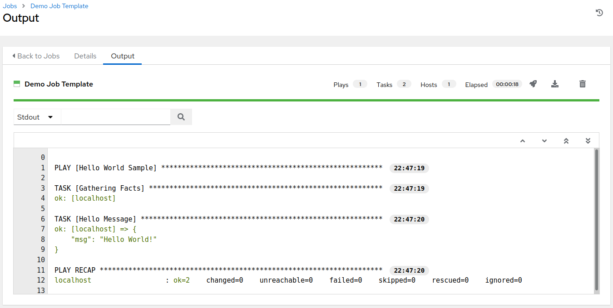
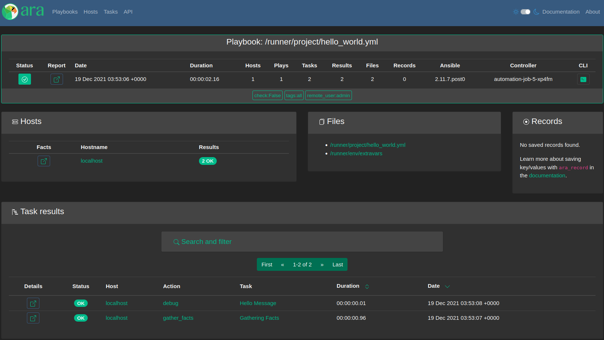

I must preface this blog post with a disclaimer.

I've debated whether this should go in documentation and settled on a blog post instead because there are some opinions involved and it's not something the project can (capital S) Support.
I wouldn't say no if someone wanted to contribute documentation or commit to support it but this has so far not materialized since the project exists.

In other words: consider this is a humble holiday season gift to you in hope that it is useful but with no guarantee.

It works and this blog post will tell you how I did it in order to point you in the right direction so you can do it on your own.
There are many different ways to do this and I cannot claim to be an expert on every component and dependency so I cannot commit to supporting everything.

Thank you for your understanding and read on o/

## About AWX

[AWX](https://github.com/ansible/awx) is one of the upstream projects for [Red Hat Ansible Automation Platform](https://www.ansible.com/products/automation-platform).
The downstream product derived from AWX used to be called Ansible Tower but it's called [Automation Controller](https://www.ansible.com/products/controller) now.

Amongst other things, it provides a web interface from which you can launch jobs for running Ansible playbooks.

ara can record these playbooks and provide reporting for them but it's not as simple as recording playbooks running from your laptop.

Here's how I did it.

## Step one: have an ara API server running somewhere

There are many ways to deploy an ara API server and we won't go into the details here but you can get started by looking at the [README](https://github.com/ansible-community/ara#recording-playbooks-with-an-api-server).

For the purpose of my testing, I've used the live demo on [demo.recordsansible.org](https://demo.recordsansible.org) which is deployed with the [ara Ansible collection](https://github.com/ansible-community/ara-collection/).

It is set up to use MySQL for the database backend with the [geerlingguy.mysql](https://github.com/geerlingguy/ansible-role-mysql) role (thanks [@geerlingguy](https://twitter.com/geerlingguy)!) but there's nothing preventing you from using PostgreSQL if you prefer.

I would not recommend running with the sqlite backend when recording multiple playbooks simultaneously since you can run into database write lock concurrency issues.

## Step two: have a Kubernetes deployment for AWX

The [AWX installation documentation](https://github.com/ansible/awx/blob/devel/INSTALL.md) mentions that starting with version 18.0, the [AWX Kubernetes operator](https://github.com/ansible/awx-operator) is the preferred way to install AWX.

awx-operator suggests using [minikube](https://github.com/kubernetes/minikube) for a test deployment but I took the opportunity to try [k3s-ansible](https://github.com/k3s-io/k3s-ansible) instead.

This post isn't about how to deploy or manage kubernetes but using k3s-ansible was simple enough for an all-in-one single node deployment for test purposes by defining just a master in the [inventory](https://github.com/k3s-io/k3s-ansible/blob/master/inventory/sample/hosts.ini).

## Step three: install awx-operator

Once we have a kubernetes environment available, we can install [awx-operator](https://github.com/ansible/awx-operator) so it can be used to deploy AWX.

I essentially followed the instructions provided in the [README's basic install](https://github.com/ansible/awx-operator#basic-install):
```bash
git clone https://github.com/ansible/awx-operator; cd awx-operator
export NAMESPACE=default
export VERSION=0.15.0

# The following assumes that kubectl is available and authenticated
make deploy
```

## Step four: install awx

With the operator installed and running, I created a file with the following content:
```yaml
---
apiVersion: awx.ansible.com/v1beta1
kind: AWX
metadata:
  name: awx-ara
spec:
  service_type: nodeport
  hostname: awx.recordsansible.org
```

I applied it by running ``kubectl apply -f awx-ara.yml`` and followed logs with ``kubectl logs -f deployments/awx-operator-controller-manager -c awx-manager`` for a while before the AWX environment was up and running.

I was eventually able to log in successfully by getting the admin password with ``kubectl get secret awx-ara-admin-password -o jsonpath="{.data.password}" | base64 --decode``.



## Step five: build an execution environment with ara installed

AWX uses [execution environments](https://www.redhat.com/en/technologies/management/ansible/automation-execution-environments) (EEs) which are container images with [ansible-runner](https://github.com/ansible/ansible-runner) and other Ansible dependencies and content pre-installed.

ara can record playbooks from ansible-runner too but that's a topic for another day :)



Back to execution environments: we need to build a new execution environment because the default ones don't have ara installed in them.
We can do this with [ansible-builder](https://github.com/ansible/ansible-builder/) and [podman](https://podman.io/) but Docker is documented to work too.

I installed podman and ansible-builder like so:
```
sudo dnf -y install podman
pip install --user ansible-builder
```

My execution environment definition looked like this (see this [GitHub repository](https://github.com/dmsimard/ee-ansible-with-ara) for all files):

```yaml
---
# execution-environment.yml
version: 1
build_arg_defaults:
  # TODO: there is no stable-2.12-latest ?
  # https://quay.io/repository/ansible/ansible-runner?tab=tags
  EE_BASE_IMAGE: 'quay.io/ansible/ansible-runner:stable-2.12-devel'

ansible_config: 'ansible.cfg'

dependencies:
# TODO: ansible-builder removes 'ansible' from requirements.txt so we can't put it there
# https://github.com/ansible/ansible-builder/issues/323
  python: requirements.txt

# The ansible package contains a curated set of Ansible collections, include it in the EE
additional_build_steps:
  append:
    - RUN pip install ansible
```

The ``ansible.cfg`` file can contain whatever you want and the ``requirements.txt`` file has a single line in it: ``ara``.

We don't need to use ``ara[server]`` here because we won't be running the ara API server from inside the execution environment container image, it will be running elsewhere.

I built the execution environment by running ``ansible-builder build`` after which I tagged it with ``podman tag localhost/ansible-execution-env quay.io/recordsansible/ee-ansible-with-ara:ansible-5.1.0`` and then pushed it to [quay.io](https://quay.io/repository/recordsansible/ee-ansible-with-ara).

Once the container image was pushed, I was able to add it in AWX like this:



## Step six: enable the ara callback plugin in AWX

Not unlike how the ara callback plugin needs to be enabled when running regular ansible-playbook commands, we also need to do it for AWX.

I recovered the path to the ara callback plugin by running ``podman run -it quay.io/recordsansible/ee-ansible-with-ara:ansible-5.1.0 python3 -m ara.setup.callback_plugins``, added it to the AWX job settings and then configured it using environment variables:



## Step seven: set up job templates to use the new execution environment

AWX job templates have a field to specify which execution environment it should run with and we need to select our new EE:



## Step eight: launch the job template as usual

When running the job template, the output should not look any different than usual:



If everything went well, the playbook should have been recorded on the ara server:



## That's the gist of it

That's what the process looks like at a high level but to summarize:

- You need an ara API server running somewhere
- Your AWX job templates must use an execution environment (EE) with the ara package installed
- The ara callback plugin path must be added to the AWX job settings and then configured using environment variables

Once again, I hope that this blog post helps point you in the right direction to make your playbooks easier to understand and troubleshoot with ara.

If you have feedback, comments, suggestions or would like to contribute, feel free to chime in [this issue on GitHub](https://github.com/ansible-community/ara/issues/24).

Happy holidays and happy automating o/
