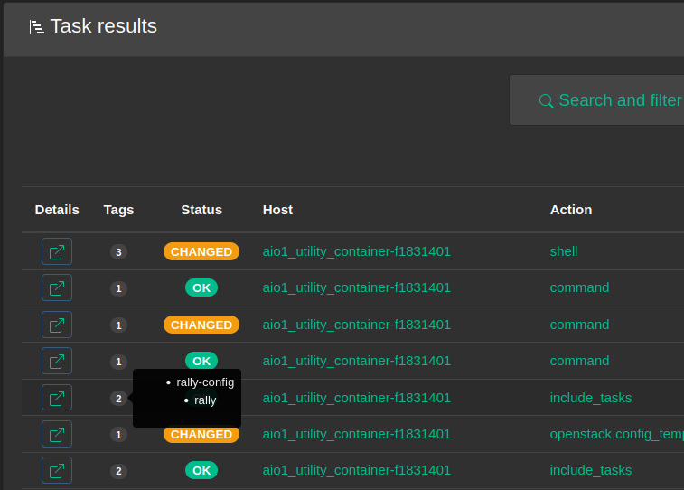

ARA 1.5.8 has been released and you can try it out with the [getting started guide](https://ara.readthedocs.io/en/latest/getting-started.html)
or by checking out the live demo at https://demo.recordsansible.org.

For the full list of changes, see the [changelog on GitHub](https://github.com/ansible-community/ara/releases/tag/1.5.8)
as well as the list of [commits since 1.5.7](https://github.com/ansible-community/ara/compare/1.5.7...1.5.8).

You can also catch up on the changelog and release notes for every version until now in the
[documentation](https://ara.readthedocs.io/en/latest/changelog-release-notes.html).

1.5.8 features fixes as well as general maintenance work to address python and dependency deprecations while adding a few features.

Note that the next version of ara, likely 1.6.0, will bump Django from 2.2 LTS to 3.2 LTS which will end support for python3.5.

In the meantime, here are some highlights for ara 1.5.8:

## Recording hostnames instead of localhost

It is not uncommon to run ``ansible-playbook`` or ``ansible-pull`` against the host you are running a playbook from -- in other words: localhost.

While ara 1.5.4 added support for recording the hostname of the controller that ran the playbook, ara would record results under localhost so it wasn't trivial to tell which host a playbook actually ran against.

This new release features new callback settings that are meant to help associate results with individual hosts even if ansible is targetting localhost.

The first is ``ARA_LOCALHOST_AS_HOSTNAME`` which, when true, will retrieve the hostname (or fqdn) of the host and then associate results to that host instead of localhost.

The second, ``ARA_LOCALHOST_AS_HOSTNAME_FORMAT`` controls the format of the hostname.
Since the hostname (or fqdn) can vary depending on how the host operating system is configured, this setting provides flexibility to get the format you prefer:

- ``fqdn`` (ex: *server.example.org*)
- ``fqdn_short`` (ex: *server*)
- ``hostname``
- ``hostname_short``

## Task tags

ara has always saved task tags but they were not shown in the reporting interface... until now:

## Special thanks

1.5.8 features four new contributors and I wanted to extend my gratitute to thank them for making this release possible, in no particular order:

- [@JayV3e](https://github.com/JayV3e) for his work on task tags
- [@goneri](https://github.com/goneri) for his help with Zuul and CI
- [@DataHearth](https://github.com/DataHearth) for hunting down deprecations and tackling long-standing logging issues
- [@cosemansbert](https://github.com/cosemansbert) for the new ``CSRF_TRUSTED_ORIGINS`` server setting

# That's it for now !

There's plenty of work left to do but it will need to be in a future release !

## Want to contribute, chat or need help ?

ARA could use your help and we can also help you get started.
Please reach out !

The project community hangs out on [IRC and Slack](https://ara.recordsansible.org/community/).

You can also stay up to date on the latest news and development by following [@RecordsAnsible](https://twitter.com/RecordsAnsible) on Twitter.
