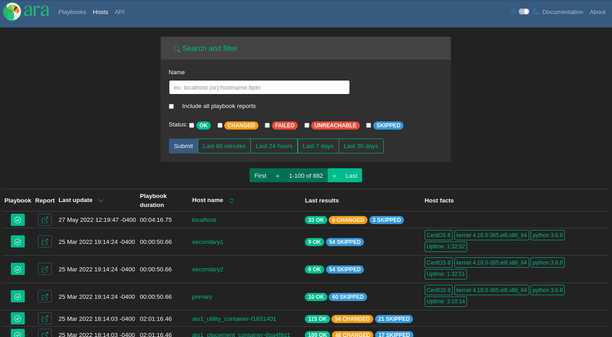
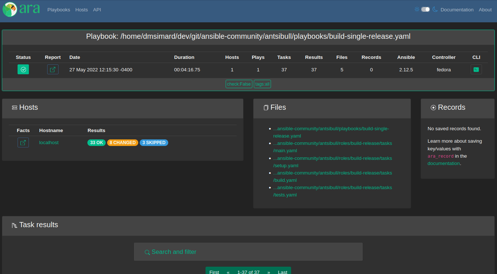

ARA 1.6.0 has been released and you can try it out with the [getting started guide](https://ara.readthedocs.io/en/latest/getting-started.html)
or by checking out the live demo at https://demo.recordsansible.org.

This blog post will highlight some of the changes since 1.5.8 but for the full list, see:

-  the [changelog on GitHub](https://github.com/ansible-community/ara/releases/tag/1.6.0)
-  the list of [commits since 1.5.8](https://github.com/ansible-community/ara/compare/1.5.8...1.6.0)

You can also catch up on the changelog and release notes for every version until now in the
[documentation](https://ara.readthedocs.io/en/latest/changelog-release-notes.html).

We'll first look at the changes in the UI and then we'll look at the ones about the Ansible callback plugin, the API and the API server.

# UI: Improvements and new features

Some table columns have been re-ordered to try and be more consistent across pages.

Otherwise, pictures are worth a thousand words but what about screenshots and gifs ?

**If they are too small, they can be opened in a new tab or window for the full resolution.**

## Playbook index

First: a comparison of the home page, the playbook index, since the last version:

1.6.0 adds a new "Tasks" link at the top. It's a brand new page that we'll look at.

There's a new field for the user that ran a playbook and it's possible to search for playbooks run by a specific user.

## Host index

A comparison of the host index since the last version:

1.6.0 removes the status of the playbook and condenses each host's task result numbers into colored pills to provide more width to other cells.

The name (or path) of each host's playbook was added to the table and it's now possible to search by playbook ID, name or path.

## Task index

There has been an API for tasks (``/api/v1/tasks``) and it has been possible to look and search for them with the CLI using [ara task list](https://ara.readthedocs.io/en/latest/cli.html#ara-task-list) but there was no implementation in the UI until now.

Analogous to the playbook and host indexes, this first iteration of the new "Tasks" page provides a searchable list of every recorded task:

This might be useful for searching tasks by name, action, file, role (part of the name) or collection (part of the action), comparing them across playbook runs or find out which are the slowest when sorting by duration.

## Playbook report card

When looking at a playbook report or something inside a playbook, there's a card with a brief summary of the playbook at the top:

In 1.6.0, it was tweaked a bit and a few things were added:

- The playbook id
- The user who ran the playbook
- The versions of ara (both client and server) involved in recording the playbook
- The version of python that ansible ran

## Task results

In addition to some table column re-ordering (like many others), it's now possible to search for results by host or task name which is easier than IDs for humans:

# Ansible callback plugin

The [callback plugin](https://docs.ansible.com/ansible/latest/plugins/callback.html) is the component of ara that collects playbook results as it is running and sends everything to be recorded in a database.

ara had certain (historical) assumptions built around running in the [serial linear strategy](https://docs.ansible.com/ansible/latest/playbook_guide/playbooks_strategies.html), meaning that tasks were expected to run one after the other on every host.

It turns out that it gets a bit complicated when running with multiple threads using the free strategy where task results for different hosts arrive out of order.

1.6.0 addresses some of those assumptions by recording results including the task UUID provided by Ansible.
Even though there is still work to do, this should be a meaningful improvement to the reliability and accuracy of recorded results when using the free strategy.

Excerpt from the changelog, other new features include:

> - Added support for recording the user who ran the playbook
> - Added support for recording the version of ara as well as the version of python used when running the playbook
> - Added options ``ARA_RECORD_USER`` and ``ARA_RECORD_CONTROLLER`` that can be set to false to avoid recording the user and controller hostname
> - Added support for specifying a SSL key, certificate and certificate authority for authenticating with a remote ara API server using ``ARA_API_KEY``, ``ARA_API_CERT`` and ``ARA_API_CA`` respectively.
> - Ignore and don't record files in ``~/.ansible/tmp`` by default

For that last one, ara saves a unique and compressed copy of playbook and role files so they can be used as part of the context when looking at a report.
Ansible created files ara had no use for in the temporary directory and the path has been excluded by default.

# API and API server

We've bumped the requirement of Django from 2.2 LTS to 3.2 LTS and dropped support for python 3.5 as a result.

There are other noteworthy changes and additions, excerpt from the changelog:

> - Added a new configuration option, ARA_BASE_PATH, to let the server
>   listen on an alternate path. It will continue to default to "/" but it
>   could, for example, be set to "/ara/".

Commonly asked about by users, this makes it possible to host the interface and API at something like ``example.org/ara/`` instead of ``ara.example.org/``.

> - Several new database model and API fields:
>   - Added client_version and server_version fields to playbooks, meant to
>     represent the version of the ara callback and server used in recording
>     the playbook
>   - Added python_version field to playbooks to save the version of python
>     used by Ansible and the callback plugin when recording a playbook

Mostly used for diagnostics purposes, they are now recorded, displayed and available for search.

>   - Added a new "failed" status for tasks that is used by the callback plugin
>     when there is at least one failed result for a given task

Before ara 1.6.0, a task did not have a concept of a "failed" status -- only whether the task was completed or not.

Calculated by the callback based on whether there has been one (or more) failures for a particular task, the status will now be "completed" or "failed" accordingly.

> - Several fixes and improvements for the distributed sqlite database backend:
>   - Added a new index page for listing and linking to available databases.
>     This is a work in progress that is intended to be improved in the future.
>   - Return a HTTP 405 error when trying to write to read-only endpoints
>   - Fixed the /healthcheck/ endpoint to make sure it is routed properly
>   - Improved database engine settings and WSGI application configuration.
>     The WSGI application should now always be "ara.server.wsgi" instead of
>     needing to specify "ara.server.wsgi.distributed_sqlite"

The [distributed sqlite backend](https://ara.readthedocs.io/en/latest/distributed-sqlite-backend.html) got a bit of attention based on production usage and feedback.

It is a special database backend that dynamically serves read-only sqlite databases from within a single instance.
It can be used to easily scale reporting to millions of playbooks when it makes sense to shard data inside individual sqlite databases like in CI/CD jobs or when using ansible-pull.

It used to be that you needed to know where the databases were located to query them but there is now a new basic index page that finds and lists them:

It is a first iteration and isn't necessarily optimal from a performance perspective, especially at a large scale, but we'll get there.

# Special thanks

This new version ships as one of the largest in a while and was made possible thanks to the help of new and returning contributors.

In no particular order, thank you:

- [@DataHearth](https://github.com/ansible-community/ara/commits?author=DataHearth) for helping with packaging and fixing a time parsing issue in the CLI
- [@hille721](https://github.com/ansible-community/ara/commits?author=hille721) for providing feedback, contributing many improvements as well as participating in issues and PRs
- [@apollo13](https://github.com/ansible-community/ara/commits?author=apollo13) for improving django things around database engine selection, WSGI app and path routing
- [@gaby](https://github.com/ansible-community/ara/commits?author=gaby) for python 3.6 cleanup and suppressing InsecureRequestWarning when appropriate
- [@DanOPT and @mocdaniel](https://github.com/ansible-community/ara/commits?author=DanOPT) for adding support for recording the user who ran a playbook

# That's it for now !

There's plenty of work left to do but it will need to be in a future release !

# Want to contribute, chat or need help ?

ARA could use your help and we can also help you get started.
Please reach out !

The project community hangs out on [IRC, Slack and Matrix](https://ara.recordsansible.org/community/).

You can also stay up to date on the latest news and development by following [@ara on fosstodon.org](https://fosstodon.org/@ara) or subscribing to the [RSS feed](https://fosstodon.org/@ara.css).
