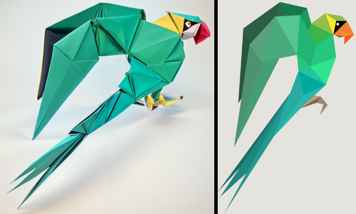
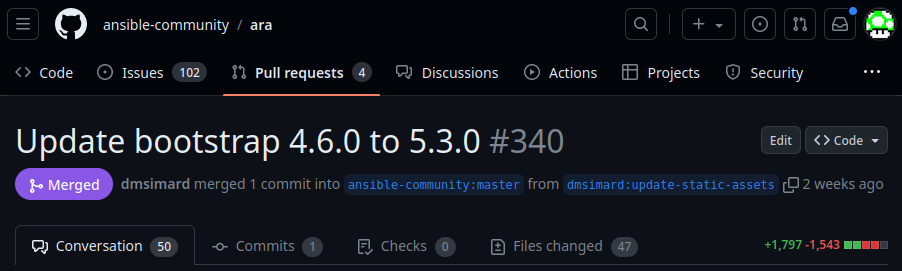
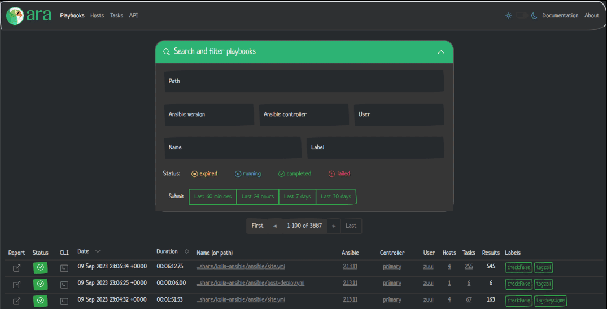
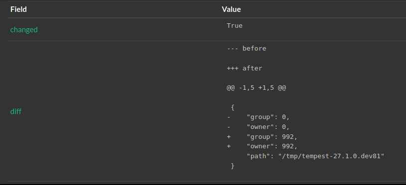
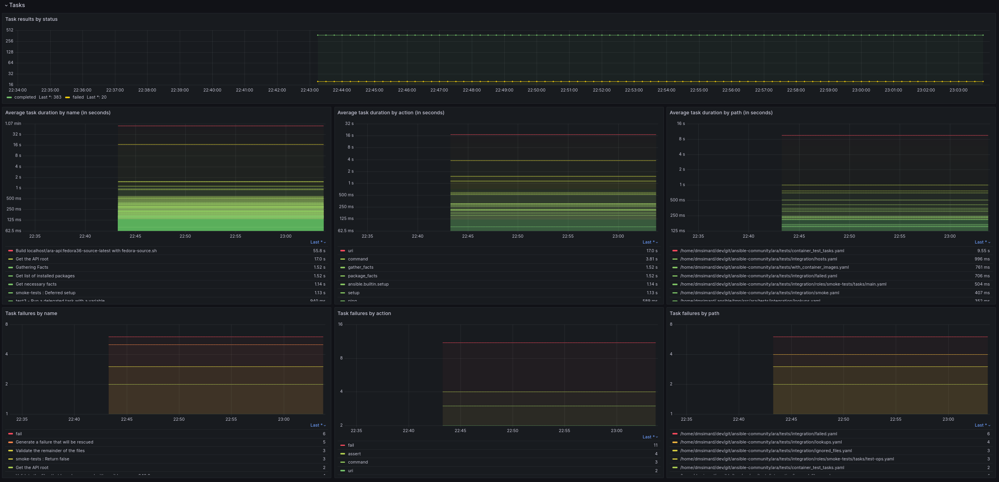

> *stable diffusion, img2img with controlnet:*<br>
> *low poly, paper craft origami parrot, illustration, studio lighting*

ARA 1.7.0 has been released and you can try it out with the [getting started guide](https://ara.readthedocs.io/en/latest/getting-started.html)
or by checking out the live demo at https://demo.recordsansible.org.

TL;DR:
```bash
# Install ansible and ara in a virtualenv
python3 -m venv ~/.ara/venv
source ~/.ara/venv/bin/activate
pip install ansible ara[server]

# Run a playbook with ara enabled
export ANSIBLE_CALLBACK_PLUGINS=$(python3 -m ara.setup.callback_plugins)
ansible-playbook playbook.yml

# Check it out in your terminal
ara playbook list

# or in your browser: http://127.0.0.1:8000
ara-manage runserver
```

# Summary

This new version features a refresh of the built-in web interface including an update of [Bootstrap](https://getbootstrap.com/) from 4.6.0 to 5.3.0.

It lifts the supported version of [Django](https://www.djangoproject.com/) up to the latest LTS, 4.2, and raises the minimum version of Python to >=3.8 as a result.

There's also bug fixes and new features.

This blog post will highlight some of the changes since ara 1.6.1 but for the full list, see:

-  the [changelog on GitHub](https://github.com/ansible-community/ara/releases/tag/1.7.0)
-  the list of [commits since 1.6.1](https://github.com/ansible-community/ara/compare/1.6.1...1.7.0)

You can also catch up on the changelog and release notes for every version until now in the [documentation](https://ara.readthedocs.io/en/latest/changelog-release-notes.html).

# A refresh for the UI



A pull request [almost two years in the making](https://github.com/ansible-community/ara/pull/340) (ok, with breaks in-between): a long overdue refresh including an update of the bootstrap CSS framework.

Just about every page needed to be fixed and it was a good opportunity to take what was there, clean it up a bit and make it more consistent.

## No more bootswatch and jquery

Until now, our Bootstrap 4 themes came from [bootswatch](https://bootswatch.com/): [flatly](https://bootswatch.com/4/flatly/) and [darkly](https://bootswatch.com/4/darkly/).
They were conveniently green and have served us well. A warm thank you to their contributors and maintainers.

In 1.7.0, ara switches to the default light theme from Bootstrap 5 along their [newly included dark theme](https://getbootstrap.com/docs/5.3/customize/color-modes/).
This avoids the need to load an extra CSS file and makes it easier to eventually implement a setting in case users want different themes:



*(Tested just by replacing [bootstrap.min.css](https://github.com/ansible-community/ara/tree/master/ara/ui/static/css))*

## New light and dark themes

In both cases, the blue header is gone, there's less green and links are blue like in the 1990's.

Here's a short video comparing the light themes:



<video width="721" height="370" controls autoplay=true loop=true>
  <source src="/blog/2023/09/12/announcing-the-release-of-ara-1.7.0/playbooks-light.mp4" type="video/mp4">
  Your browser does not support the video tag.
</video>



Another short video, this time comparing the dark themes:



<video width="721" height="370" controls autoplay=true loop=true>
  <source src="/blog/2023/09/12/announcing-the-release-of-ara-1.7.0/playbooks-dark.mp4" type="video/mp4">
  Your browser does not support the video tag.
</video>



## General improvements

The text, links and buttons are generally bigger -- they should be easier to read and click:



<video width="721" height="370" controls autoplay=true loop=true>
  <source src="/blog/2023/09/12/announcing-the-release-of-ara-1.7.0/playbook.mp4" type="video/mp4">
  Your browser does not support the video tag.
</video>



## Better diffs

Thanks to [helmo](https://github.com/ansible-community/ara/pull/481) we now have coloured diffs when recording with ``ansible-playbook --diff``:



## A mobile UI in a pinch

Leveraging Bootstrap means we get some amount of mobile responsiveness out of the box.

It has improvements over the previous version, though it's certainly not perfect, it's there and it works:



<video width="306" height="600" controls autoplay>
  <source src="/blog/2023/09/12/announcing-the-release-of-ara-1.7.0/mobile.mp4" type="video/mp4">
  Your browser does not support the video tag.
</video>



# New recording settings

We have three new settings for ara's Ansible callback plugin thanks to new contributors to the project.

By default, ara automatically detects the controller hostname and the user who is running a playbook in order to record them.
[phemmer](https://github.com/ansible-community/ara/pull/496) added two settings, ``ARA_RECORD_CONTROLLER_NAME`` and ``ARA_RECORD_USER_NAME``, in order to override and customize their values.

ara also records the content of every task result but in some cases it's either not necessary or desireable in order to decrease risks of leaking secrets.
[tomsiewert](https://github.com/ansible-community/ara/pull/458) added the setting ``ARA_RECORD_TASK_CONTENT`` which can be set to false in order to prevent ara from recording task content.

# That's it for now, what's next ?

There is no shortage of improvement opportunities but some bigger items in the not-too-distant future...

There are discussions around trying to [make the callback non-blocking](https://github.com/ansible-community/ara/pull/459) that we should revisit in order to reduce the [overhead of ara](https://ara.recordsansible.org/blog/2023/02/26/benchmarking-ara-with-different-databases-and-python3.11-for-fun-and-science/) and improve playbook performance.

We've also been trying to write a [Prometheus exporter](https://github.com/ansible-community/ara/pull/483) for alerting and putting Ansible metrics in pretty graphs because why not:



# Want to contribute, chat or need help ?

The prometheus exporter kind of works but we would welcome the help of anyone interested to look into that with us, please reach out !

The web interface has a lot of untapped potential and we would certainly appreciate contributors to improve the UI and UX.

We could use your help and we can help you [get started](https://ara.readthedocs.io/en/latest/contributing.html).

The project community hangs out on [IRC, Slack and Matrix](https://ara.recordsansible.org/community/).

You can also stay up to date on the latest news and development by following [@ara on fosstodon.org](https://fosstodon.org/@ara) or subscribing to the [RSS feed](https://fosstodon.org/@ara.css).
