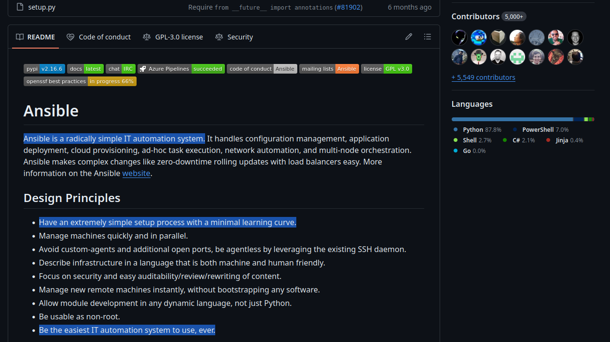
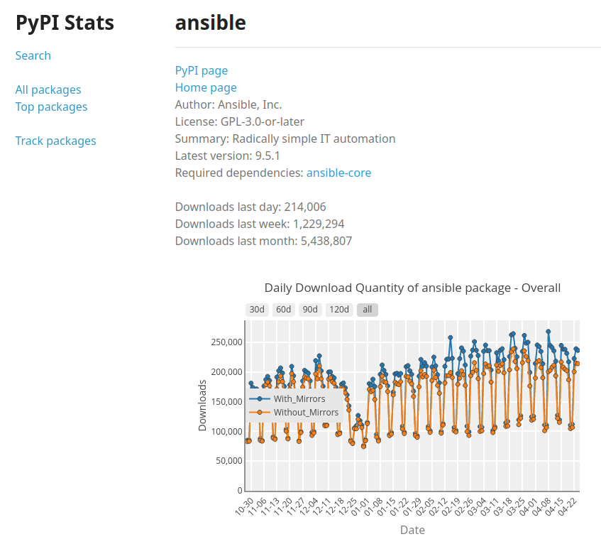

I like to say that simplicity is a feature of [ara](https://github.com/ansible-community/ara).

The project was consciously designed to be simple by adhering to principles from the [UNIX philosophy](https://en.wikipedia.org/wiki/Unix_philosophy) (*do one thing and do it well*) and the [Zen of Python](https://peps.python.org/pep-0020/) (*simple is better than complex*):

- It records Ansible and makes it easier to understand and troubleshoot.
- It is expected to be simple to install and use.
- It is intended to have few moving parts and a limited number of dependencies.
- It doesn't require Kubernetes ¯\\_(ツ)_/¯

I believe simplicity is a feature of Ansible, too:

Recently, there's been a [discussion](https://forum.ansible.com/t/future-of-the-ansible-community-package/4902) around whether the [ansible](https://pypi.org/project/ansible/) community package should continue to exist and provide the "batteries-included" in addition to [ansible-core](https://pypi.org/project/ansible-core/).

> If you are curious to learn more about why or how Ansible was split between ``ansible`` and ``ansible-core``:
> - https://www.ansible.com/blog/thoughts-on-restructuring-the-ansible-project/
> - https://www.ansible.com/blog/announcing-the-community-ansible-3.0.0-package/

I felt compelled to participate in the thread since I have contributed to how the package is [built, tested and shipped](https://www.youtube.com/watch?v=5_QEhQRfKRo) since the split of ``ansible`` after 2.10.
But... honestly, I have been working on my mental health lately so I decided not to.

For what it's worth, my opinion has largely unchanged since this was last discussed ([here](https://github.com/ansible-community/community-topics/issues/82#issuecomment-1075441361)) so I decided to write a love letter for the Ansible community package instead.

# A love letter

I love the Ansible community package because it's simple.

There's one package (*available on PyPI as well as most distros*) to install and users are ready to develop and run playbooks against most operating systems, databases, clouds and network devices out of the box.

It isn't necessary to learn, use and rely on ansible-galaxy or GitHub to get started
and I think that's great.

I know firsthand that making the community package happen is not without challenges: I acknowledge the maintenance, governance, and committee participation that needs to happen to make this work and it is not simple. Let alone the politics.

I am grateful for everyone that is involved and I am convinced that the result is worth it.

There are reasons why ``ansible`` is installed more than [5 million times a month](https://pypistats.org/packages/ansible) from PyPI alone:

It is not perfect but we can make it better: it is healthy to question how the maintenance and governance could be better, made easier and more sustainable.

It's fine to have different options that cater to different needs.

Users can continue to cherry-pick the collections they want with ``ansible-core`` or [AWX](https://github.com/ansible/awx).
They are not mutually exclusive with the existence of the Ansible community package.

Simplicity is a feature.

Thank you :)
